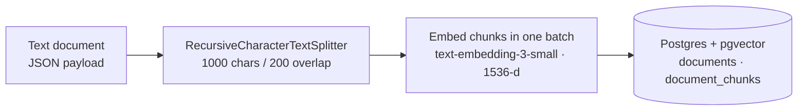
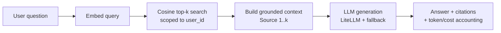
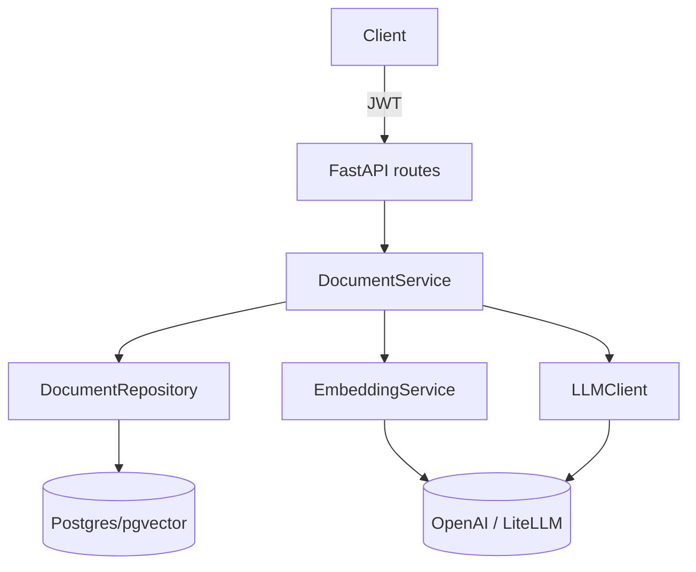

<div align="center">

# 🔎 Production RAG

**A Retrieval-Augmented Generation system built the way you'd actually ship one — layered, async, cost-aware, and honest about what's production-ready and what isn't.**

[](https://www.python.org/)
[](https://fastapi.tiangolo.com/)
[](https://github.com/pgvector/pgvector)
[](https://github.com/BerriAI/litellm)
[](LICENSE)

[Quickstart](#-quickstart) · [Architecture](#-architecture) · [What's real vs. planned](#-status-what-works-today) · [API](#-api) · [Roadmap](#-roadmap) · [Design decisions](#-design-decisions)

</div>

---

## TL;DR

This repo implements the **RAG pipeline end-to-end**: upload a PDF/DOCX/HTML/Markdown file → extract with page & section provenance → chunk → embed → store in pgvector behind an **HNSW index** → retrieve by cosine similarity with scores → ground an LLM answer with source citations and per-request cost tracking. Re-uploading an unchanged source is a genuine no-op; an edited one is replaced transactionally. It runs today.

It is **not yet a "production" RAG system**, and this README won't pretend otherwise. There is no reranking, no hybrid/keyword search, and — most importantly — **no evaluation harness**, which means the chunk size, the embedding model, and the index parameters are all defaults rather than defended choices. The [decision report](docs/rag-production-decisions.md) enumerates what's left as ~49 explicit engineering decisions, including several correctness bugs that only surface under multi-tenant load.

> **Why build it this way?** A convincing engineering artifact isn't a demo that hides its seams — it's a system with a clear boundary between *what's built*, *what's measured*, and *what's next*. That boundary is the whole point of this repo.

---

## ✨ Highlights

- **Clean layering** — routes → services → repositories, with dependency injection throughout. No business logic in the transport layer.
- **Async everywhere** — FastAPI + SQLAlchemy async + `asyncpg`, non-blocking from HTTP edge to database.
- **Provider-agnostic LLM access** — [LiteLLM](https://github.com/BerriAI/litellm) with automatic retries and a fallback model, so a single provider outage doesn't take the system down.
- **Cost & latency accounting** — every generation logs input/output tokens and USD cost via structured logging (`structlog`).
- **Grounded generation** — an anti-hallucination system prompt that refuses to answer outside the retrieved context, with per-source citations returned to the caller.
- **Multi-tenant by design** — documents and retrieval are scoped per user, with JWT auth on every endpoint.

---

## 🏗 Architecture

### Ingestion pipeline



### Query pipeline (RAG)



### Request flow



---

## 📊 Status: what works today

Honest inventory, verified against the source. ✅ = implemented and running · ⚠️ = works, but the choice is a default rather than a measured decision · ❌ = not built yet. Per-stage detail in the [decision report](docs/rag-production-decisions.md).

| Stage | Status | What's there now | The production gap |
|---|:---:|---|---|
| **Document ingestion** | ✅ | `POST /documents/upload` (multipart) — PDF / DOCX / HTML / Markdown / text via a MIME→loader registry, emitting segments with page & section provenance | Synchronous with the request (holds a transaction across the whole embed); no normalization pass; no quality gate against scanned/empty PDFs |
| **Idempotency** | ✅ | `(user_id, source)` identity, DB-enforced; `content_hash` + `chunker_version` + `embedding_model` gating; unchanged re-upload costs zero embedding calls; race-safe via savepoint | No cross-document dedup; no delete path, so the corpus only grows |
| **Chunking** | ⚠️ | One recursive splitter (1000 / 200 chars), applied **per structural segment** so chunks never straddle a page or heading; `char_start` / `char_end` / `page` / `section` populated | Single fixed strategy, never compared; sized in characters while every downstream budget is in tokens; no re-chunk backfill |
| **Embedding** | ⚠️ | LiteLLM, `text-embedding-3-small`, 1536-d, config-wired, batched, cost-logged | Model chosen by default, never benchmarked; `Vector(1536)` hardcoded against a swappable setting; unbounded batch size; no chunk-level cache |
| **Vector store** | ✅ | Postgres + pgvector, **HNSW index** (`vector_cosine_ops`, `m=16`, `ef_construction=64`, set explicitly and documented in the migration) | Params untuned against eval metrics; `hnsw.ef_search` never set; the `owner_id` filter degrades ANN recall (see [D3](docs/rag-production-decisions.md)) |
| **Retrieval** | ⚠️ | Dense cosine top-k, user-scoped, **similarity scores returned**; `retrieve()` split out from `query()` so it's measurable without an LLM | Vector-only — no hybrid/keyword, so exact-match queries have no working path; no metadata filters; no score threshold or abstention |
| **Reranking** | ❌ | — | No second-stage reranker or rank fusion |
| **Generation** | ✅ | Grounded prompt, per-source citations with scores, cost tracking, provider fallback, TTL answer cache that evals can bypass | No streaming; no claim-level citation mapping; prompt is unversioned and absent from the cache key |
| **Evaluation** | ❌ | — | No dataset, no retrieval/generation metrics, no regression gate. **This is why five rows above are ⚠️ rather than ✅.** |
| **API** | ⚠️ | Upload / query / list, JWT-auth | No delete, no streaming endpoint, no ingestion status, no rate limiting, unbounded `top_k` |
| **Deployment** | ⚠️ | `docker-compose` runs Postgres | No app Dockerfile, no CI/CD, no live deploy, no real readiness probe |

---

## 🚀 Quickstart

**Prerequisites:** Python 3.12+, [`uv`](https://github.com/astral-sh/uv), Docker (for Postgres), and an OpenAI API key.

```bash
# 1. Clone and install
git clone <your-repo-url> production-rag && cd production-rag
uv sync

# 2. Configure environment
cp .env.example .env
# edit .env → set OPENAI_API_KEY (and ANTHROPIC_API_KEY for the fallback model)

# 3. Start Postgres (pgvector image)
docker compose up -d

# 4. Run database migrations
uv run alembic upgrade head

# 5. Launch the API
uv run uvicorn production_rag.main:app --reload
```

The API is now live at **http://127.0.0.1:8000** — interactive docs at **/docs**.

```bash
# Run the test suite
uv run pytest

# Lint & type-check
uv run ruff check .
uv run mypy src
```

---

## 🔌 API

All document endpoints require a JWT (obtain one via the auth routes). Examples assume `$TOKEN` is set.

**Ingest a document**

```bash
curl -X POST http://127.0.0.1:8000/documents \
  -H "Authorization: Bearer $TOKEN" \
  -H "Content-Type: application/json" \
  -d '{"title": "Company Handbook", "content": "Our refund policy is 30 days..."}'
```

**Ask a question (full RAG)**

```bash
curl -X POST http://127.0.0.1:8000/documents/query \
  -H "Authorization: Bearer $TOKEN" \
  -H "Content-Type: application/json" \
  -d '{"question": "What is the refund policy?", "top_k": 5}'
```

```jsonc
{
  "answer": "The refund policy is 30 days [Source 1].",
  "sources": [
    { "chunk_id": "…", "document_title": "Company Handbook",
      "content_preview": "Our refund policy is 30 days...", "similarity_rank": 1 }
  ],
  "model": "gpt-4.1-nano",
  "input_tokens": 312,
  "output_tokens": 18,
  "cost_usd": 0.000048
}
```

**List your documents**

```bash
curl http://127.0.0.1:8000/documents -H "Authorization: Bearer $TOKEN"
```

---

## 🗂 Project structure

```
src/production_rag/
├── routes/          # FastAPI endpoints (documents, auth, agent, health)
├── services/        # Business logic — DocumentService owns the RAG pipeline
├── repositories/    # Data access — pgvector cosine search lives here
├── llm/             # LLMClient (LiteLLM + fallback) and EmbeddingService
├── models/          # SQLAlchemy models (Document, DocumentChunk, User)
├── schemas/         # Pydantic request/response contracts
├── agent/           # Tool-calling agent loop over the RAG tools
├── config.py        # Pydantic-settings configuration
└── main.py          # App factory & wiring
migrations/          # Alembic migrations
tests/               # Pytest suite (async, testcontainers)
docs/                # Technical report & roadmap
```

---

## 🧭 Roadmap

Sequenced by *what unblocks the most other decisions*. Every remaining choice — with its options, trade-offs, and the measurement that would justify it — is enumerated in **[docs/rag-production-decisions.md](docs/rag-production-decisions.md)**. The original phase plan is preserved in [docs/rag-production-roadmap.md](docs/rag-production-roadmap.md).

- ✅ **Phase 1 — Make retrieval production-correct** · HNSW index (`vector_cosine_ops`), similarity scores returned, N+1 title lookups removed by denormalization, chunk provenance columns.
- ✅ **Phase 2 — Ingestion** · Multi-format file loaders (PDF/DOCX/HTML/MD), content hashing for idempotent re-ingestion, transactional in-place replace. *(Pluggable chunkers and the embedding cache remain open.)*
- 🔜 **Tier 0 — Correctness first** · Six defects that only surface under production conditions: filtered-ANN recall collapse under multi-tenancy, mixed embedding models ranking silently, hardcoded vector dimension, an unimplemented `filters` parameter, unbounded context, default JWT secret.
- 🔜 **Tier 1 — Evaluation pipeline** · Golden Q/A + gold-context dataset stratified by query type, retrieval metrics (Recall@k, MRR, nDCG), generation metrics (faithfulness, relevance, correctness), CI regression gate. **Everything below is a guess until this exists.**
- **Tier 2 — Hybrid retrieval + reranking** · `tsvector` keyword search, Reciprocal Rank Fusion, cross-encoder reranker (retrieve top-30 → rerank to top-5), abstention threshold — each adopted only if the numbers justify it.
- **Tier 3 — Deployment & hardening** · Async ingestion with status, app Dockerfile, CI (ruff/mypy/pytest + eval gate), a real deploy target, streaming + delete + rate limiting, metrics and cost aggregation.
- **Tier 4 — Deliberately deferred** · Query rewriting, feedback loops, hierarchical/Graph/agentic RAG — with the adoption trigger for each written down rather than silently skipped.

---

## 🧠 Design decisions

- **Postgres + pgvector over a dedicated vector DB** — one datastore for relational data *and* embeddings means transactional ingestion, familiar ops, and no second system to run for a workload of this size.
- **LiteLLM as the LLM boundary** — swap providers or models via config, with retries and a fallback model, without touching business logic.
- **Repository pattern** — retrieval SQL is isolated in one place, so adding an index, hybrid search, or reranking is a change to the data layer, not a rewrite of the service.
- **Grounded-only prompting** — the system prompt instructs the model to answer strictly from retrieved context and to decline when the context is insufficient, trading eagerness for trustworthiness.
- **Cost as a first-class signal** — token counts and USD cost are logged per request, because a RAG system you can't measure is a RAG system you can't tune.

---

## ⚠️ Known limitations

These are tracked, not hidden — each maps to a decision in the [decision report](docs/rag-production-decisions.md):

- **No evaluation** → retrieval and answer quality are not measured, which is why the chunk size, the embedding model, and the HNSW parameters are defaults rather than defended choices. This is the top priority, not the last phase. *(Part G)*
- **Vector-only retrieval** → no keyword/hybrid channel, so exact-match queries (IDs, acronyms, proper nouns) have no working retrieval path; no reranking precision lift. *(E2, E5)*
- **Filtered-ANN recall** → pgvector applies the `owner_id` filter *after* the HNSW graph walk, so a multi-tenant query can silently return fewer results than requested. Correctness bug, not a tuning knob. *(D3)*
- **Synchronous ingestion** → a large PDF embeds inline in the request, holding a transaction open for its duration. *(A2)*
- **Denormalized chunk titles** → each chunk stores a copy of its document title for fast retrieval, so a future document-rename endpoint must also update those copies.

---

<div align="center">

Built as a portfolio piece to demonstrate **production RAG engineering** — layering, async, cost-awareness, and an honest path from MVP to production.

📄 **[Read the decision report →](docs/rag-production-decisions.md)** · [Original roadmap](docs/rag-production-roadmap.md)

</div>
