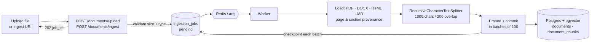
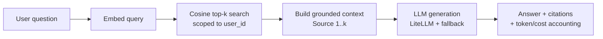
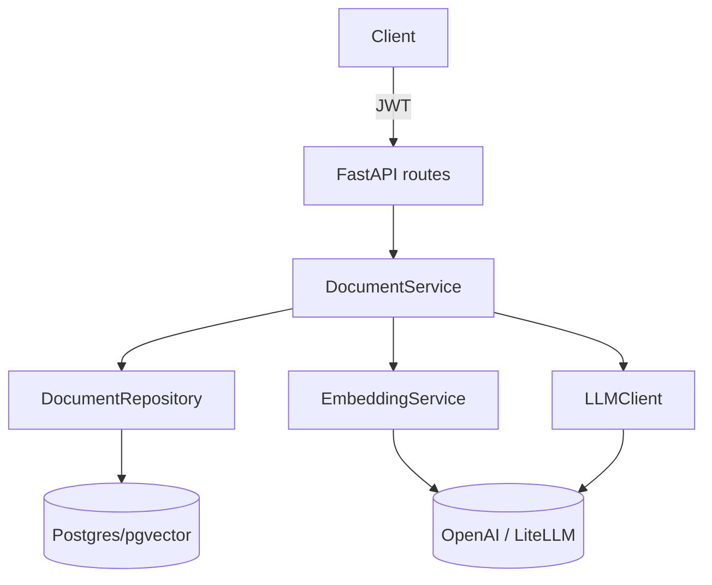

<div align="center">

# 🔎 Production RAG

**A Retrieval-Augmented Generation system built the way you'd actually ship one — layered, async, cost-aware, and honest about what's production-ready and what isn't.**

[](https://www.python.org/)
[](https://fastapi.tiangolo.com/)
[](https://github.com/pgvector/pgvector)
[](https://github.com/BerriAI/litellm)
[](LICENSE)

[Quickstart](#-quickstart) · [Architecture](#-architecture) · [What's real vs. planned](#-status-what-works-today) · [API](#-api) · [Roadmap](#-roadmap) · [Design decisions](#-design-decisions)

</div>

---

## TL;DR

This repo implements the **RAG pipeline end-to-end**: upload a PDF/DOCX/HTML/Markdown file → extract with page & section provenance → chunk → embed → store in pgvector behind an **HNSW index** → retrieve by cosine similarity with scores → ground an LLM answer with source citations and per-request cost tracking. Re-uploading an unchanged source is a genuine no-op; an edited one is replaced transactionally. It runs today.

It is **not yet a "production" RAG system**, and this README won't pretend otherwise. There is no reranking, no hybrid/keyword search, and — most importantly — **no evaluation harness**, which means the chunk size, the embedding model, and the index parameters are all defaults rather than defended choices. The [decision report](docs/rag-production-decisions.md) enumerates what's left as ~49 explicit engineering decisions, including several correctness bugs that only surface under multi-tenant load.

> **Why build it this way?** A convincing engineering artifact isn't a demo that hides its seams — it's a system with a clear boundary between *what's built*, *what's measured*, and *what's next*. That boundary is the whole point of this repo.

---

## ✨ Highlights

- **Clean layering** — routes → services → repositories, with dependency injection throughout. No business logic in the transport layer.
- **Async everywhere** — FastAPI + SQLAlchemy async + `asyncpg`, non-blocking from HTTP edge to database.
- **Provider-agnostic LLM access** — [LiteLLM](https://github.com/BerriAI/litellm) with automatic retries and a fallback model, so a single provider outage doesn't take the system down.
- **Cost & latency accounting** — every generation logs input/output tokens and USD cost via structured logging (`structlog`).
- **Grounded generation** — an anti-hallucination system prompt that refuses to answer outside the retrieved context, with per-source citations returned to the caller.
- **Multi-tenant by design** — documents and retrieval are scoped per user, with JWT auth on every endpoint.

---

## 🏗 Architecture

### Ingestion pipeline



A killed worker resumes from its last committed batch: chunking is deterministic, so
`processed_chunks` doubles as a resume cursor. Poll `GET /documents/jobs/{job_id}` for progress.

### Query pipeline (RAG)



### Request flow



---

## 📊 Status: what works today

Honest inventory, verified against the source. ✅ = implemented and running · ⚠️ = works, but the choice is a default rather than a measured decision · ❌ = not built yet. Per-stage detail in the [decision report](docs/rag-production-decisions.md).

| Stage | Status | What's there now | The production gap |
|---|:---:|---|---|
| **Document ingestion** | ✅ | `POST /documents/upload` (multipart) and `POST /documents/ingest` (`https://`, `gdrive://`) — PDF / DOCX / HTML / Markdown / text via a MIME→loader registry, emitting segments with page & section provenance. A **quality gate** rejects PDFs below 50 chars/page (dividing by the PDF's real page count, not the pages that parsed) with the measurements that justify it | Threshold is one number, unvalidated against a real corpus; no boilerplate detection |
| **OCR / Office formats** | ✅ | **Document AI Layout Parser** as a *fallback* extractor — reached only when the gate fails or no local parser exists, so a readable document costs nothing. Adds `.xlsx` / `.xlsm` / `.pptx`, which have no local parser at all. PDFs sharded to the 15-page online limit with page offsets restored; batch via Cloud Storage past 60 pages; extraction cached on the job row so a retry never re-buys it. [Setup runbook](docs/document-ai-setup.md) | Batch path unproven against a real 500-page scan; its own chunker deliberately unused; no measurement of whether OCR'd text retrieves worse than parsed text |
| **Normalization** | ✅ | Unicode NFKC + whitespace, applied to documents **and** queries under identical rules. `NORMALIZER_VERSION` sits in the idempotency gate beside `chunker_version` and `embedding_model`, so a rules change can never serve vectors computed under the old ones. `reindex` CLI re-processes stale documents | Mechanical only — no boilerplate or header/footer detection; NFKC is lossy for math notation |
| **Async ingestion** | ✅ | Redis + **arq** worker, `ingestion_jobs` table, `202 + job_id`, `GET /documents/jobs/{id}`. Embeds in batches of 100, checkpointing each — a killed worker resumes from its cursor instead of re-embedding. Orphaned jobs reclaimed by a heartbeat sweeper. Failures land in an append-only **`failed_ingestions`** dead-letter table with a countable `reason`, and non-retryable ones (a scan is still a scan on attempt three) stop retrying instead of burning the budget. `GET /documents/failures`, `POST /documents/failures/{id}/retry` | Failed jobs retain their payload with no retention policy; polling rather than SSE; no job cancellation |
| **Idempotency** | ✅ | `(user_id, source)` identity, DB-enforced; `content_hash` + `chunker_version` + `embedding_model` gating; unchanged re-upload costs zero embedding calls; race-safe via savepoint | No cross-document dedup; no delete path, so the corpus only grows |
| **Chunking** | ⚠️ | One recursive splitter (1000 / 200 chars), applied **per structural segment** on normalized text so chunks never straddle a page or heading; `char_start` / `char_end` / `page` / `section` populated | Single fixed strategy, never compared; sized in characters while every downstream budget is in tokens; no re-chunk backfill |
| **Embedding** | ⚠️ | LiteLLM, `text-embedding-3-small`, 1536-d, config-wired, batched in bounded groups of 100, cost-logged | Model chosen by default, never benchmarked; `Vector(1536)` hardcoded against a swappable setting; no chunk-level cache |
| **Vector store** | ✅ | Postgres + pgvector, **HNSW index** (`vector_cosine_ops`, `m=16`, `ef_construction=64`) declared on the model *and* in its migration, so it exists under test rather than only in production. `hnsw.ef_search` (100) and `hnsw.iterative_scan` set per query via `SET LOCAL` | Params untuned against eval metrics; the iterative-scan fix for filtered-ANN under-return is **applied but not yet proven at scale** (see [D3](docs/rag-production-decisions.md)) |
| **Metadata** | ✅ | Extractive at ingest — detected `language`, `document_date`, `doc_type`, `mime_type` — in **one `metadata JSONB` column with a GIN (`jsonb_path_ops`) index**, on documents and denormalized onto chunks. Undetermined keys are omitted, never stored as `null` | Heuristic `doc_type` over a closed set of 7 classes, es/en markers only; no model-derived metadata (NER, topic); no user-supplied metadata on upload |
| **Retrieval** | ⚠️ | Dense cosine top-k, user-scoped, **similarity scores returned**; `retrieve()` split out from `query()` so it's measurable without an LLM; **metadata filtering applied inside the ANN query** (see below) | Vector-only — no hybrid/keyword, so exact-match queries have no working path; filters are flat equality only (no ranges, no OR); no score threshold or abstention |
| **Reranking** | ❌ | — | No second-stage reranker or rank fusion |
| **Generation** | ✅ | Grounded prompt, per-source citations with scores, cost tracking, provider fallback, TTL answer cache that evals can bypass | No streaming; no claim-level citation mapping; prompt is unversioned and absent from the cache key |
| **Evaluation** | ❌ | — | No dataset, no retrieval/generation metrics, no regression gate. **This is why five rows above are ⚠️ rather than ✅.** |
| **API** | ⚠️ | Upload / ingest-by-URI / query / list / job status / failure list + retry, JWT-auth | No delete, no streaming endpoint, no rate limiting, unbounded `top_k` |
| **Deployment** | ⚠️ | `docker-compose` runs Postgres + Redis | No app or worker Dockerfile, no CI/CD, no live deploy, no real readiness probe |

---

## 🔎 Hybrid filtering: metadata + vectors in one query

Similarity search alone cannot answer *"the **Spanish** contracts"* — only *"the passages that read
like contracts"*, which is a different and worse question. So each document carries metadata
extracted at ingest, and retrieval filters on it **inside** the vector query:

```bash
curl -X POST localhost:8000/documents/query -H "Authorization: Bearer $TOKEN" \
  -H 'Content-Type: application/json' \
  -d '{"question": "¿Cuál es la cláusula de rescisión?",
       "filters": {"language": "es", "doc_type": "contract"}}'
```

### One JSONB column, not a column per field

Which metadata a retrieval system needs is not knowable up front. This one starts with four fields
and will plausibly want author, retention class, and a sensitivity label. As typed columns, each of
those is an `ALTER TABLE` on a large table plus a coordinated deploy. As JSONB, they are writes.

What that gives up is real and accepted: no per-key `NOT NULL`, no per-key type enforcement, no
foreign keys. Validation lives in `ingestion/metadata.py`, next to the extraction rules. The
extractor's version travels *inside* the document, so even "which rows predate the current
extractor?" needs no migration:

```sql
SELECT id, source FROM documents
WHERE metadata->>'extractor_version' IS DISTINCT FROM 'extractive-v1';
```

### Why `@>` and not `->>`

The intuitive form reads better and is the wrong choice — it does not use the index:

```sql
-- Implemented. Uses ix_document_chunks_metadata_gin.
WHERE owner_id = :uid AND metadata @> '{"language":"es","doc_type":"contract"}'::jsonb

-- Same rows, no index.
WHERE owner_id = :uid AND metadata->>'language' = 'es' AND metadata->>'doc_type' = 'contract'
```

`EXPLAIN ANALYZE` over 20k chunks (pgvector 0.8.2 / PostgreSQL 16), both predicates in isolation:

```
@>    Bitmap Heap Scan  (actual rows=800)
        └─ Bitmap Index Scan on document_chunks_metadata_idx  (actual rows=800)

->>   Seq Scan          (actual rows=800)
        Rows Removed by Filter: 19200
```

A GIN index over `jsonb_path_ops` indexes **containment**, not text extraction. Making `->>`
indexable takes one expression index *per key* — which is the per-field migration the JSONB column
exists to avoid, reintroduced one layer down. `jsonb_path_ops` over the default `jsonb_ops` follows
from the same commitment: containment is the only operator used, so key-existence support would be
index bloat paid for on every write.

### The part that is easy to get wrong

pgvector applies `WHERE` to what the HNSW walk *finds*, not before it. Adding predicates can
therefore make a query return **fewer rows than `LIMIT`, with no error** — recall degrading in
silence. Every ANN query sets `hnsw.iterative_scan` and an explicit `hnsw.ef_search` first, and
because `relaxed_order` returns approximate ordering, results are re-sorted outside the scan (the
similarity score is what an eval harness ranks on, so it cannot be left approximate).

That mitigation is applied and its settings are asserted in the test suite, but the corpus needed to
*reproduce* the collapse is larger than a test should build — so it is not yet proven at scale. See
[D3](docs/rag-production-decisions.md) for the experiment that would close it.

---

## 🚀 Quickstart

**Prerequisites:** Python 3.12+, [`uv`](https://github.com/astral-sh/uv), Docker (Postgres + Redis), and an OpenAI API key.

```bash
# 1. Clone and install
git clone <your-repo-url> production-rag && cd production-rag
uv sync

# 2. Configure environment
cp .env.example .env
# edit .env → set OPENAI_API_KEY (and ANTHROPIC_API_KEY for the fallback model)

# 3. Start Postgres (pgvector) and Redis
docker compose up -d

# 4. Run database migrations
uv run alembic upgrade head

# 5. Start the ingestion worker (separate terminal)
uv run arq production_rag.worker.WorkerSettings

# 6. Launch the API
uv run uvicorn production_rag.main:app --reload
```

The API is now live at **http://127.0.0.1:8000** — interactive docs at **/docs**.

**Optional — OCR.** Scanned PDFs are rejected by the quality gate and `.xlsx`/`.pptx` return 415
until Google Document AI is configured. That is a project, a region, a created processor, an IAM
role and a regional endpoint, not an API key — the [setup runbook](docs/document-ai-setup.md)
walks through it in the order that makes each failure obvious.

```bash
# Run the test suite
uv run pytest

# Lint & type-check
uv run ruff check .
uv run mypy src
```

---

## 🔌 API

All document endpoints require a JWT (obtain one via the auth routes). Examples assume `$TOKEN` is set.

**Ingest a document**

```bash
curl -X POST http://127.0.0.1:8000/documents \
  -H "Authorization: Bearer $TOKEN" \
  -H "Content-Type: application/json" \
  -d '{"title": "Company Handbook", "content": "Our refund policy is 30 days..."}'
```

**Ask a question (full RAG)**

```bash
curl -X POST http://127.0.0.1:8000/documents/query \
  -H "Authorization: Bearer $TOKEN" \
  -H "Content-Type: application/json" \
  -d '{"question": "What is the refund policy?", "top_k": 5}'
```

Add `filters` to restrict the search to chunks whose extracted metadata contains every key/value
given — applied inside the vector query, so `top_k` counts *matching* chunks rather than being eaten
by non-matching ones. A flat map of scalars; nested objects and arrays are rejected with a 422.

```bash
  -d '{"question": "¿Cuál es la cláusula de rescisión?",
       "filters": {"language": "es", "doc_type": "contract"}}'
```

```jsonc
{
  "answer": "The refund policy is 30 days [Source 1].",
  "sources": [
    { "chunk_id": "…", "document_title": "Company Handbook",
      "content_preview": "Our refund policy is 30 days...", "similarity_rank": 1 }
  ],
  "model": "gpt-4.1-nano",
  "input_tokens": 312,
  "output_tokens": 18,
  "cost_usd": 0.000048
}
```

**List your documents**

```bash
curl http://127.0.0.1:8000/documents -H "Authorization: Bearer $TOKEN"
```

Each document carries the metadata extracted at ingest. Keys that could not be determined are
absent rather than `null` — these are the keys the query `filters` accept:

```jsonc
{
  "id": "…", "title": "contrato", "chunk_count": 12, "source": "upload://…/contrato.pdf",
  "metadata": {
    "language": "es", "doc_type": "contract", "document_date": "2024-03-15",
    "mime_type": "application/pdf", "extractor_version": "extractive-v1"
  }
}
```

---

## 🗂 Project structure

```
src/production_rag/
├── routes/          # FastAPI endpoints (documents, auth, agent, health)
├── services/        # Business logic — DocumentService owns the RAG pipeline
├── ingestion/       # Source URIs, connectors, loaders, normalization, metadata extraction
├── repositories/    # Data access — pgvector cosine search + metadata filtering live here
├── llm/             # LLMClient (LiteLLM + fallback) and EmbeddingService
├── models/          # SQLAlchemy models (Document, DocumentChunk, User)
├── schemas/         # Pydantic request/response contracts
├── agent/           # Tool-calling agent loop over the RAG tools
├── config.py        # Pydantic-settings configuration
└── main.py          # App factory & wiring
migrations/          # Alembic migrations
tests/               # Pytest suite (async, testcontainers)
docs/                # Technical report & roadmap
```

---

## 🧭 Roadmap

Sequenced by *what unblocks the most other decisions*. Every remaining choice — with its options, trade-offs, and the measurement that would justify it — is enumerated in **[docs/rag-production-decisions.md](docs/rag-production-decisions.md)**. The original phase plan is preserved in [docs/rag-production-roadmap.md](docs/rag-production-roadmap.md).

- ✅ **Phase 1 — Make retrieval production-correct** · HNSW index (`vector_cosine_ops`), similarity scores returned, N+1 title lookups removed by denormalization, chunk provenance columns.
- ✅ **Phase 2 — Ingestion** · Multi-format file loaders (PDF/DOCX/HTML/MD), content hashing for idempotent re-ingestion, transactional in-place replace. *(Pluggable chunkers and the embedding cache remain open.)*
- ✅ **A3 — Versioned normalization** · NFKC + whitespace before embedding, symmetric on the query side, with `NORMALIZER_VERSION` in the idempotency gate and a `reindex` command for content processed under superseded rules.
- ✅ **A2 — Async ingestion** · Redis/arq queue, job status table, batch checkpointing with resume, orphan recovery. Upload of a large document returns in ~80ms instead of ~40–60s.
- ✅ **A4 + E4 — Metadata & hybrid filtering** · Extractive metadata (language, document date, doc type, MIME) in a GIN-indexed `metadata JSONB` column, and the previously-dead `filters` parameter implemented over it as JSONB containment inside the ANN query.
- 🔜 **Tier 0 — Correctness first** · Four defects still open of the original six: mixed embedding models ranking silently, hardcoded vector dimension, unbounded context, default JWT secret. The `filters` parameter is now implemented rather than removed; filtered-ANN recall is mitigated (`hnsw.iterative_scan` + explicit `ef_search`) but **not yet proven at scale** — the multi-tenant recall experiment is the outstanding item.
- 🔜 **Tier 1 — Evaluation pipeline** · Golden Q/A + gold-context dataset stratified by query type, retrieval metrics (Recall@k, MRR, nDCG), generation metrics (faithfulness, relevance, correctness), CI regression gate. **Everything below is a guess until this exists.**
- **Tier 2 — Hybrid retrieval + reranking** · `tsvector` keyword search, Reciprocal Rank Fusion, cross-encoder reranker (retrieve top-30 → rerank to top-5), abstention threshold — each adopted only if the numbers justify it.
- **Tier 3 — Deployment & hardening** · Async ingestion with status, app Dockerfile, CI (ruff/mypy/pytest + eval gate), a real deploy target, streaming + delete + rate limiting, metrics and cost aggregation.
- **Tier 4 — Deliberately deferred** · Query rewriting, feedback loops, hierarchical/Graph/agentic RAG — with the adoption trigger for each written down rather than silently skipped.

---

## 🧠 Design decisions

- **Postgres + pgvector over a dedicated vector DB** — one datastore for relational data *and* embeddings means transactional ingestion, familiar ops, and no second system to run for a workload of this size.
- **LiteLLM as the LLM boundary** — swap providers or models via config, with retries and a fallback model, without touching business logic.
- **Repository pattern** — retrieval SQL is isolated in one place, so adding an index, hybrid search, or reranking is a change to the data layer, not a rewrite of the service.
- **Grounded-only prompting** — the system prompt instructs the model to answer strictly from retrieved context and to decline when the context is insufficient, trading eagerness for trustworthiness.
- **Cost as a first-class signal** — token counts and USD cost are logged per request, because a RAG system you can't measure is a RAG system you can't tune.

---

## ⚠️ Known limitations

These are tracked, not hidden — each maps to a decision in the [decision report](docs/rag-production-decisions.md):

- **No evaluation** → retrieval and answer quality are not measured, which is why the chunk size, the embedding model, and the HNSW parameters are defaults rather than defended choices. This is the top priority, not the last phase. *(Part G)*
- **Vector-only retrieval** → no keyword/hybrid channel, so exact-match queries (IDs, acronyms, proper nouns) have no working retrieval path; no reranking precision lift. *(E2, E5)*
- **Filtered-ANN recall — mitigated, unproven** → pgvector applies filters *after* the HNSW graph walk, so a multi-tenant or metadata-filtered query can silently return fewer results than requested. `hnsw.iterative_scan` and an explicit `ef_search` are now set per query, and the test suite asserts they are really in force — but at test corpus size the query returns a full page *with the fix disabled too*, so nothing here has yet demonstrated the fix works. Reproducing the collapse needs tens of thousands of vectors. Treat it as plausible, not proven. *(D3)*
- **Heuristic document typing** → `doc_type` is keyword-matched over a closed set of 7 classes with Spanish/English markers only, so a document outside that set (or in another language) lands in `other` and is invisible to a `doc_type` filter. Deliberately extractive — no model call in the ingest path — but it is the weakest of the four metadata fields. *(A4)*
- **Filters are equality-only** → JSONB containment expresses "this key equals this scalar" and nothing else: no ranges (`document_date > 2024-01-01`), no OR, no negation. A date range — the most obviously useful filter for a corpus with dates — is not expressible today. *(E4)*
- **NFKC is lossy for notation** → `x²` becomes `x2` and `½` becomes `1⁄2`. A deliberate trade (it makes a PDF's `file` ligature match a search for `file`), pinned by a test so changing it is a conscious act — but wrong for a math-heavy corpus, which would want NFC under a new version string. *(A3)*
- **Re-index loses structure for uploaded files** → an `upload://` document has no staged bytes to re-read and no fetchable URI, so it rebuilds from the stored body and its `page`/`section` values come back NULL. Logged per document. Re-upload the original to restore them. *(A3)*
- **Normalization's recall impact is unmeasured** → the claim that it improves retrieval is standard and plausible, and entirely unproven here until the eval harness exists. *(Part G)*
- **Non-atomic ingestion** → per-batch commits are what make a job resumable, so a document is briefly visible to retrieval while it is still being ingested. Harmless when new; during a *replace* that document has reduced content until the job finishes. *(A2)*
- **Denormalized chunk titles** → each chunk stores a copy of its document title for fast retrieval, so a future document-rename endpoint must also update those copies.

---

<div align="center">

Built as a portfolio piece to demonstrate **production RAG engineering** — layering, async, cost-awareness, and an honest path from MVP to production.

📄 **[Read the decision report →](docs/rag-production-decisions.md)** · [Original roadmap](docs/rag-production-roadmap.md)

</div>
