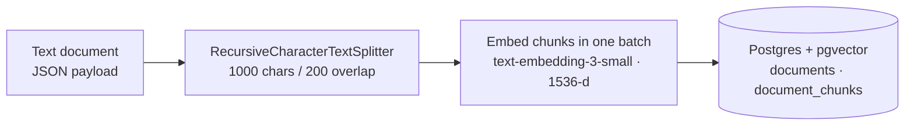
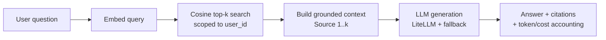
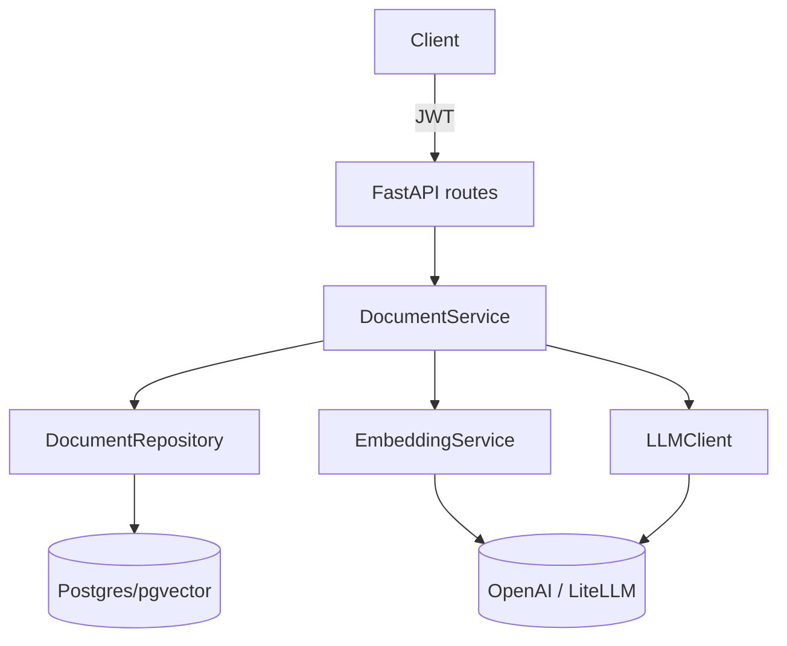

<div align="center">

# 🔎 Production RAG

**A Retrieval-Augmented Generation system built the way you'd actually ship one — layered, async, cost-aware, and honest about what's production-ready and what isn't.**

[](https://www.python.org/)
[](https://fastapi.tiangolo.com/)
[](https://github.com/pgvector/pgvector)
[](https://github.com/BerriAI/litellm)
[](LICENSE)

[Quickstart](#-quickstart) · [Architecture](#-architecture) · [What's real vs. planned](#-status-what-works-today) · [API](#-api) · [Roadmap](#-roadmap) · [Design decisions](#-design-decisions)

</div>

---

## TL;DR

This repo implements the **RAG happy path end-to-end**: ingest text → chunk → embed → store in pgvector → retrieve by cosine similarity → ground an LLM answer with source citations and per-request cost tracking. It runs today.

It is **not yet a "production" RAG system**, and this README won't pretend otherwise. There is no vector index (every query is a sequential scan), no file loaders, no reranking, no hybrid search, and no evaluation harness. The [roadmap](#-roadmap) below is the plan to close that gap — and the [full technical report](docs/rag-production-roadmap.md) is the gap analysis behind it.

> **Why build it this way?** A convincing engineering artifact isn't a demo that hides its seams — it's a system with a clear boundary between *what's built*, *what's measured*, and *what's next*. That boundary is the whole point of this repo.

---

## ✨ Highlights

- **Clean layering** — routes → services → repositories, with dependency injection throughout. No business logic in the transport layer.
- **Async everywhere** — FastAPI + SQLAlchemy async + `asyncpg`, non-blocking from HTTP edge to database.
- **Provider-agnostic LLM access** — [LiteLLM](https://github.com/BerriAI/litellm) with automatic retries and a fallback model, so a single provider outage doesn't take the system down.
- **Cost & latency accounting** — every generation logs input/output tokens and USD cost via structured logging (`structlog`).
- **Grounded generation** — an anti-hallucination system prompt that refuses to answer outside the retrieved context, with per-source citations returned to the caller.
- **Multi-tenant by design** — documents and retrieval are scoped per user, with JWT auth on every endpoint.

---

## 🏗 Architecture

### Ingestion pipeline



### Query pipeline (RAG)



### Request flow



---

## 📊 Status: what works today

Honest inventory. ✅ = implemented and running · ⚠️ = works but MVP-only · ❌ = not built yet (see [roadmap](#-roadmap)).

| Stage | Status | What's there now | The production gap |
|---|:---:|---|---|
| **Document ingestion** | ⚠️ | `POST /documents` — raw text via JSON | No file upload; no PDF/DOCX/HTML/Markdown loaders; no content hashing / idempotency |
| **Chunking** | ⚠️ | One recursive splitter (1000 / 200); per-chunk char offsets captured | Single fixed strategy; no token-based or structure-aware chunking; `page`/`section` still pending loaders |
| **Embedding** | ✅ | LiteLLM, `text-embedding-3-small`, 1536-d, batched, cost-logged | No embedding cache; dimension hardcoded to the model |
| **Vector store** | ✅ | Postgres + pgvector, `Vector(1536)`, **HNSW index** (`vector_cosine_ops`) | Index params not yet tuned against eval metrics |
| **Retrieval** | ⚠️ | Dense cosine top-k, user-scoped, **similarity scores returned** | Vector-only; no hybrid/keyword, no metadata filters |
| **Reranking** | ❌ | — | No second-stage reranker or rank fusion |
| **Generation** | ✅ | Grounded prompt, citations, cost tracking, provider fallback | No streaming; no citation-span mapping |
| **Evaluation** | ❌ | — | No dataset, no retrieval/generation metrics, no regression gate |
| **API** | ⚠️ | Upload / query / list, JWT-auth | No delete, no streaming endpoint, no rate limiting |
| **Deployment** | ⚠️ | `docker-compose` runs Postgres | No app Dockerfile, no CI/CD, no live deploy |

---

## 🚀 Quickstart

**Prerequisites:** Python 3.12+, [`uv`](https://github.com/astral-sh/uv), Docker (for Postgres), and an OpenAI API key.

```bash
# 1. Clone and install
git clone <your-repo-url> production-rag && cd production-rag
uv sync

# 2. Configure environment
cp .env.example .env
# edit .env → set OPENAI_API_KEY (and ANTHROPIC_API_KEY for the fallback model)

# 3. Start Postgres (pgvector image)
docker compose up -d

# 4. Run database migrations
uv run alembic upgrade head

# 5. Launch the API
uv run uvicorn production_rag.main:app --reload
```

The API is now live at **http://127.0.0.1:8000** — interactive docs at **/docs**.

```bash
# Run the test suite
uv run pytest

# Lint & type-check
uv run ruff check .
uv run mypy src
```

---

## 🔌 API

All document endpoints require a JWT (obtain one via the auth routes). Examples assume `$TOKEN` is set.

**Ingest a document**

```bash
curl -X POST http://127.0.0.1:8000/documents \
  -H "Authorization: Bearer $TOKEN" \
  -H "Content-Type: application/json" \
  -d '{"title": "Company Handbook", "content": "Our refund policy is 30 days..."}'
```

**Ask a question (full RAG)**

```bash
curl -X POST http://127.0.0.1:8000/documents/query \
  -H "Authorization: Bearer $TOKEN" \
  -H "Content-Type: application/json" \
  -d '{"question": "What is the refund policy?", "top_k": 5}'
```

```jsonc
{
  "answer": "The refund policy is 30 days [Source 1].",
  "sources": [
    { "chunk_id": "…", "document_title": "Company Handbook",
      "content_preview": "Our refund policy is 30 days...", "similarity_rank": 1 }
  ],
  "model": "gpt-4.1-nano",
  "input_tokens": 312,
  "output_tokens": 18,
  "cost_usd": 0.000048
}
```

**List your documents**

```bash
curl http://127.0.0.1:8000/documents -H "Authorization: Bearer $TOKEN"
```

---

## 🗂 Project structure

```
src/production_rag/
├── routes/          # FastAPI endpoints (documents, auth, agent, health)
├── services/        # Business logic — DocumentService owns the RAG pipeline
├── repositories/    # Data access — pgvector cosine search lives here
├── llm/             # LLMClient (LiteLLM + fallback) and EmbeddingService
├── models/          # SQLAlchemy models (Document, DocumentChunk, User)
├── schemas/         # Pydantic request/response contracts
├── agent/           # Tool-calling agent loop over the RAG tools
├── config.py        # Pydantic-settings configuration
└── main.py          # App factory & wiring
migrations/          # Alembic migrations
tests/               # Pytest suite (async, testcontainers)
docs/                # Technical report & roadmap
```

---

## 🧭 Roadmap

Sequenced by production-signal-per-effort. The full file-level plan lives in **[docs/rag-production-roadmap.md](docs/rag-production-roadmap.md)**.

- **Phase 1 — Make retrieval production-correct** · HNSW index (`vector_cosine_ops`), return similarity scores, fix N+1 title lookups, add chunk metadata.
- **Phase 2 — Ingestion & chunking strategy** · Multi-format file loaders (PDF/DOCX/HTML/MD), content hashing for idempotency, ≥2 pluggable chunkers, embedding cache.
- **Phase 3 — Hybrid retrieval + reranking** · `tsvector` keyword search, Reciprocal Rank Fusion, cross-encoder / Cohere reranker (retrieve top-30 → rerank to top-5).
- **Phase 4 — Evaluation pipeline** · Curated Q/A + gold-context dataset, retrieval metrics (recall@k, MRR, nDCG), generation metrics (faithfulness, relevance), `make eval` report.
- **Phase 5 — Deployment & API hardening** · App Dockerfile, CI (ruff/mypy/pytest + eval regression gate), a real deploy target, streaming + delete + rate limiting.
- **Phase 6 — Documentation & ADRs** · Architecture write-ups and Architecture Decision Records justifying each choice with eval numbers.

---

## 🧠 Design decisions

- **Postgres + pgvector over a dedicated vector DB** — one datastore for relational data *and* embeddings means transactional ingestion, familiar ops, and no second system to run for a workload of this size.
- **LiteLLM as the LLM boundary** — swap providers or models via config, with retries and a fallback model, without touching business logic.
- **Repository pattern** — retrieval SQL is isolated in one place, so adding an index, hybrid search, or reranking is a change to the data layer, not a rewrite of the service.
- **Grounded-only prompting** — the system prompt instructs the model to answer strictly from retrieved context and to decline when the context is insufficient, trading eagerness for trustworthiness.
- **Cost as a first-class signal** — token counts and USD cost are logged per request, because a RAG system you can't measure is a RAG system you can't tune.

---

## ⚠️ Known limitations

These are tracked, not hidden — see the [roadmap](#-roadmap) and [technical report](docs/rag-production-roadmap.md):

- **No vector index** → retrieval is O(n); fine for a demo corpus, unusable at scale.
- **Text-only ingestion** → real documents are files; loaders are Phase 2.
- **No evaluation** → retrieval and answer quality are currently unmeasured.
- **Vector-only retrieval** → no keyword/hybrid recall, no reranking precision lift yet.

---

<div align="center">

Built as a portfolio piece to demonstrate **production RAG engineering** — layering, async, cost-awareness, and an honest path from MVP to production.

📄 **[Read the full technical report →](docs/rag-production-roadmap.md)**

</div>
