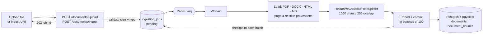

# Eval audit sheet — run `seed20260810`

50 items. For each, set `decision:` to `accept`, `reject`, or `edit`.

- **accept** — the question is answerable by someone who has never seen the chunk,
  the answer is correct, and the cited snippet is the text that answers it.
- **reject** — anything else. `reason:` is required.
- **edit** — salvageable with a better question or answer. Fill `question:` and/or
  `answer:`. An edited question gets a new id; the original is kept on the record.

For multi-hop, the question that matters is: *does answering it genuinely need BOTH
chunks?* If either alone would do, reject. For unanswerable, it is: *could anything in
this corpus answer this?* If yes, reject.

Leave nothing blank — `audit-apply` refuses a sheet with an unfilled decision rather
than applying half of it.

---

## 1 / 50 · `pa_2b5fb426db5d` · paraphrase
⚠️ warnings: snippet_spans_chunk_overlap

**Q:** What does a number greater than zero indicate regarding the setup?

**A:** It indicates that all five things are in place.

### Gold 1 — document-ai-setup.md · chunk 9 · § 6. Smoke-test before touching the application

> **cited snippet:** A number greater than zero means all five things are in place.


<details><summary>full chunk text (400 chars)</summary>

```
A number greater than zero means all five things are in place.

| Symptom | Cause |
|---|---|
| `404` / `NOT_FOUND` | wrong region in the URL, or a processor id that does not exist |
| `403` / `PERMISSION_DENIED` | the caller lacks `roles/documentai.apiUser` |
| `INVALID_ARGUMENT` about pages | over 15 pages — expected for the raw API; the application shards |
| `billing` in the message | step 1 |
```

</details>

```verdict
qid: pa_2b5fb426db5d
decision:
reason:
question:
answer:
```

---

## 2 / 50 · `pa_50011012f1d0` · paraphrase
⚠️ warnings: snippet_spans_chunk_overlap

**Q:** What does a number greater than zero indicate in the smoke-test?

**A:** A number greater than zero means all five things are in place.

### Gold 1 — document-ai-setup.md · chunk 8 · § 6. Smoke-test before touching the application

> **cited snippet:** A number greater than zero means all five things are in place.


<details><summary>full chunk text (747 chars)</summary>

```
## 6. Smoke-test before touching the application

Do this before setting anything in `.env`. It separates "my Google configuration is
wrong" from "my code is wrong", which is the entire reason to do it in this order —
those two failures look identical from inside the worker.

```bash
B64=$(base64 -i sample.pdf | tr -d '\n')
curl -X POST \
-H "Authorization: Bearer $(gcloud auth print-access-token)" \
-H "Content-Type: application/json" \
"https://us-documentai.googleapis.com/v1/projects/PROJECT_ID/locations/us/processors/PROCESSOR_ID:process" \
-d "{\"rawDocument\":{\"mimeType\":\"application/pdf\",\"content\":\"$B64\"}}" \
| jq '.document.documentLayout.blocks | length'
```

A number greater than zero means all five things are in place.
```

</details>

```verdict
qid: pa_50011012f1d0
decision:
reason:
question:
answer:
```

---

## 3 / 50 · `pa_644049be90de` · paraphrase
⚠️ warnings: reclassified_from_exact_term

**Q:** What SQL command is used to check the extractor version in the documents?

**A:** The SQL command used is a SELECT statement that checks the extractor version in the documents.

### Gold 1 — readme.md · chunk 20 · § One JSONB column, not a column per field

> **cited snippet:** SELECT id, source FROM documents
WHERE metadata->>'extractor_version' IS DISTINCT FROM 'extractive-v1';


<details><summary>full chunk text (770 chars)</summary>

```
### One JSONB column, not a column per field

Which metadata a retrieval system needs is not knowable up front. This one starts with four fields
and will plausibly want author, retention class, and a sensitivity label. As typed columns, each of
those is an `ALTER TABLE` on a large table plus a coordinated deploy. As JSONB, they are writes.

What that gives up is real and accepted: no per-key `NOT NULL`, no per-key type enforcement, no
foreign keys. Validation lives in `ingestion/metadata.py`, next to the extraction rules. The
extractor's version travels *inside* the document, so even "which rows predate the current
extractor?" needs no migration:

```sql
SELECT id, source FROM documents
WHERE metadata->>'extractor_version' IS DISTINCT FROM 'extractive-v1';
```
```

</details>

```verdict
qid: pa_644049be90de
decision:
reason:
question:
answer:
```

---

## 4 / 50 · `pa_97141b02e780` · paraphrase
⚠️ warnings: snippet_spans_chunk_overlap

**Q:** What are the limitations regarding the dataset and metrics in the evaluation section?

**A:** There is no dataset, no retrieval/generation metrics, and no regression gate.

### Gold 1 — readme.md · chunk 17 · § 📊 Status: what works today

> **cited snippet:** No dataset, no retrieval/generation metrics, no regression gate. **This is why five rows above are ⚠️ rather than ✅.**


<details><summary>full chunk text (468 chars)</summary>

```
| **Evaluation** | ❌ | — | No dataset, no retrieval/generation metrics, no regression gate. **This is why five rows above are ⚠️ rather than ✅.** |
| **API** | ⚠️ | Upload / ingest-by-URI / query / list / job status / failure list + retry, JWT-auth | No delete, no streaming endpoint, no rate limiting, unbounded `top_k` |
| **Deployment** | ⚠️ | `docker-compose` runs Postgres + Redis | No app or worker Dockerfile, no CI/CD, no live deploy, no real readiness probe |
```

</details>

```verdict
qid: pa_97141b02e780
decision:
reason:
question:
answer:
```

---

## 5 / 50 · `pa_a504763ed0c2` · paraphrase
⚠️ warnings: snippet_length

**Q:** What should be set to true to enable OCR in the application?

**A:** The OCR_ENABLED setting should be set to true to enable OCR.

### Gold 1 — document-ai-setup.md · chunk 10 · § 7. Configure the application

> **cited snippet:** OCR_ENABLED=true


<details><summary>full chunk text (401 chars)</summary>

```
## 7. Configure the application

```bash
OCR_ENABLED=true
DOCUMENTAI_PROJECT_ID=PROJECT_ID
DOCUMENTAI_LOCATION=us
DOCUMENTAI_PROCESSOR_ID=<hex id from step 3>
DOCUMENTAI_PROCESSOR_VERSION=pretrained-layout-parser-v1.0-2024-06-03
DOCUMENTAI_SERVICE_ACCOUNT_FILE=secrets/your-key.json # or leave empty to reuse the Drive key
DOCUMENTAI_GCS_BUCKET=<the bucket from step 5> # leave empty to skip batch
```
```

</details>

```verdict
qid: pa_a504763ed0c2
decision:
reason:
question:
answer:
```

---

## 6 / 50 · `pa_cdef32edbc99` · paraphrase
⚠️ warnings: snippet_spans_chunk_overlap

**Q:** How does the performance of the two SQL predicates compare based on the `EXPLAIN ANALYZE` results?

**A:** The `@>` operator uses a Bitmap Heap Scan and is more efficient, while the `->>` operator requires a Seq Scan and removes many more rows by filter.

### Gold 1 — rag-production-decisions.md · chunk 97 · § E4. Can retrieval be filtered by metadata?

> **cited snippet:** @> Bitmap Heap Scan (actual rows=800) -> Bitmap Index Scan on ..._metadata_gin (rows=800)
->> Seq Scan (actual rows=800) Rows Removed by Filter: 19200


<details><summary>full chunk text (621 chars)</summary>

```
**Why `@>` and not `->>`.** The intuitive form reads better and is the wrong choice:

```sql
-- Implemented. Uses ix_document_chunks_metadata_gin.
WHERE owner_id = :uid AND metadata @> '{"language":"es","doc_type":"contract"}'::jsonb

-- Equivalent result, no index.
WHERE owner_id = :uid AND metadata->>'language' = 'es' AND metadata->>'doc_type' = 'contract'
```

Measured on 20k chunks (pgvector 0.8.2 / PG 16), `EXPLAIN ANALYZE` of the two predicates alone:

```
@> Bitmap Heap Scan (actual rows=800) -> Bitmap Index Scan on ..._metadata_gin (rows=800)
->> Seq Scan (actual rows=800) Rows Removed by Filter: 19200
```
```

</details>

```verdict
qid: pa_cdef32edbc99
decision:
reason:
question:
answer:
```

---

## 7 / 50 · `pa_e7328065255f` · paraphrase
⚠️ warnings: snippet_length

**Q:** What are the two permanent choices when creating a processor in Document AI?

**A:** The two permanent choices are the region, which can be either 'us' or 'eu', and the processor type, which can be 'LAYOUT_PARSER_PROCESSOR' or 'OCR_PROCESSOR'.

### Gold 1 — document-ai-setup.md · chunk 3 · § 3. Create the processor

> **cited snippet:** Two choices here are permanent:

- **Region** (`us` or `eu`). It is baked into the endpoint *and* into the processor's
resource name. Moving regions later means creating a new processor and re-ingesting
anything you want re-parsed. Pick `eu` if the corpus is EU-resident.
- **Processor type.** `LAYOUT_PARSER_PROCESSOR` is the only general-purpose processor
that reads OOXML — "HTML and OOXML support are only available with layout parser".


<details><summary>full chunk text (1000 chars)</summary>

```
## 3. Create the processor

Console → **Document AI → Processor Gallery → Layout Parser → Create**. Or:

```bash
curl -X POST \
-H "Authorization: Bearer $(gcloud auth print-access-token)" \
-H "Content-Type: application/json" \
"https://us-documentai.googleapis.com/v1/projects/PROJECT_ID/locations/us/processors" \
-d '{"displayName":"production-rag-layout","type":"LAYOUT_PARSER_PROCESSOR"}'
```

Two choices here are permanent:

- **Region** (`us` or `eu`). It is baked into the endpoint *and* into the processor's
resource name. Moving regions later means creating a new processor and re-ingesting
anything you want re-parsed. Pick `eu` if the corpus is EU-resident.
- **Processor type.** `LAYOUT_PARSER_PROCESSOR` is the only general-purpose processor
that reads OOXML — "HTML and OOXML support are only available with layout parser".
`OCR_PROCESSOR` is cheaper and would handle scanned PDFs, but no spreadsheets.

The response's `name` ends in a hex id. That tail is `DOCUMENTAI_PROCESSOR_ID`.
```

</details>

```verdict
qid: pa_e7328065255f
decision:
reason:
question:
answer:
```

---

## 8 / 50 · `pa_9684c5a5c71e` · paraphrase

**Q:** What date is indicated as the last update for the status column?

**A:** The last update for the status column is indicated as 2026-07-15.

### Gold 1 — rag-production-roadmap.md · chunk 4 · § 2. Current-State Inventory

> **cited snippet:** The "Status" column reflects 2026-07-15.


<details><summary>full chunk text (244 chars)</summary>

```
## 2. Current-State Inventory

> **Stale as of 2026-08-07.** The "Status" column reflects 2026-07-15. A "Now" column has been
> added showing verified current state; see `rag-production-decisions.md` §0 for the full
> claim-by-claim correction.
```

</details>

```verdict
qid: pa_9684c5a5c71e
decision:
reason:
question:
answer:
```

---

## 9 / 50 · `pa_7912787da4ae` · paraphrase

**Q:** What is the requirement for the location parameter when creating a storage bucket?

**A:** The `--location` must match the processor's region from step 3: `US` for a `us` processor, `EU` for an `eu` one.

### Gold 1 — document-ai-setup.md · chunk 6 · § 5. Create the batch bucket (large documents only)

> **cited snippet:** `--location` must match the processor's region from step 3: `US` for a `us` processor,
`EU` for an `eu` one.


<details><summary>full chunk text (906 chars)</summary>

```
```bash
BUCKET=PROJECT_ID-docai # e.g. paddington-production-rag-docai

gcloud storage buckets create gs://$BUCKET --location=US --uniform-bucket-level-access
gcloud storage buckets add-iam-policy-binding gs://$BUCKET \
--member="serviceAccount:SA_EMAIL" --role="roles/storage.objectAdmin"
```

`--location` must match the processor's region from step 3: `US` for a `us` processor,
`EU` for an `eu` one. A bucket in the wrong place still works but pays cross-region
egress on every large document.

`--member` takes the `serviceAccount:` prefix exactly once, followed by the account's
email — `serviceAccount:name@project.iam.gserviceaccount.com`. Doubling the prefix is a
400, not a helpful error.

The worker deletes its staging objects in a `finally`, so the bucket should stay empty.
Add a 1-day lifecycle rule anyway — it is the backstop for the case where the process
dies between upload and cleanup:
```

</details>

```verdict
qid: pa_7912787da4ae
decision:
reason:
question:
answer:
```

---

## 10 / 50 · `pa_2983fac4a90a` · paraphrase

**Q:** What formats are now included in the supported-format list?

**A:** The supported-format list now includes PDF, DOCX, HTML, Markdown, text, XLSX, XLSM, and PPTX.

### Gold 1 — rag-production-decisions.md · chunk 6 · § 0. Correction to the existing roadmap

> **cited snippet:** the supported-format list above is now PDF / DOCX / HTML / Markdown
/ text **plus XLSX / XLSM / PPTX**


<details><summary>full chunk text (788 chars)</summary>

```
**Also corrected 2026-08-07:** the README's TL;DR and status table claimed "no vector index (every
query is a sequential scan), no file loaders." That was false and understated the work — a README
that under-claims is as much an accuracy defect as one that over-claims. Both have been reconciled
against verified state, and the roadmap now carries a banner pointing here.

**Also corrected 2026-08-08:** the supported-format list above is now PDF / DOCX / HTML / Markdown
/ text **plus XLSX / XLSM / PPTX**, the last three reachable only where Document AI is configured
(**A6**). "Supported" is therefore a property of a deployment rather than of the codebase, which
is why `POST /documents/upload` answers 415 or 202 for the same spreadsheet depending on whether
credentials are present.
```

</details>

```verdict
qid: pa_2983fac4a90a
decision:
reason:
question:
answer:
```

---

## 11 / 50 · `pa_520554f00126` · paraphrase

**Q:** What features are necessary for a production document ingestion system?

**A:** A production document ingestion system requires multi-format loaders, content extraction, encoding/mime detection, and idempotent re-ingestion to prevent duplicate embeds.

### Gold 1 — rag-production-roadmap.md · chunk 9 · § 3.1 Document ingestion — ⚠️ Partial

> **cited snippet:** - **Gap:** Real documents are files. A production system needs multi-format loaders,
content extraction, encoding/mime detection, and idempotent re-ingestion (content
hashing to avoid duplicate embeds).


<details><summary>full chunk text (400 chars)</summary>

```
### 3.1 Document ingestion — ⚠️ Partial
- **Now:** `POST /documents` accepts a JSON `{title, content}` — plaintext only. No file
upload, no PDF/DOCX/HTML/Markdown parsing, no OCR, no URL ingestion.
- **Gap:** Real documents are files. A production system needs multi-format loaders,
content extraction, encoding/mime detection, and idempotent re-ingestion (content
hashing to avoid duplicate embeds).
```

</details>

```verdict
qid: pa_520554f00126
decision:
reason:
question:
answer:
```

---

## 12 / 50 · `pa_9a8e09646b03` · paraphrase

**Q:** What is the current method for attributing responses to their sources?

**A:** The current method is chunk-level attribution, which lists the chunks used along with titles, previews, ranks, and similarity scores.

### Gold 1 — rag-production-decisions.md · chunk 112 · § F3. How are claims attributed back to sources?

> **cited snippet:** Chunk-level attribution — the response lists which chunks were used, with titles,
previews, ranks, and similarity scores. Solid, and better than most demos.


<details><summary>full chunk text (928 chars)</summary>

```
- **State:** ⚠️
- **Now:** Chunk-level attribution — the response lists which chunks were used, with titles,
previews, ranks, and similarity scores. Solid, and better than most demos.
- **Gap:** No **claim-level** mapping. The user cannot tell which sentence of the answer came from
which source, and cannot jump to the exact span — even though `char_start`/`char_end`/`page`/
`section` are already populated and `Document.content` is stored.
- **Options:** (a) chunk-level (current); (b) inline citation markers the model emits, validated
against the real source list; (c) post-hoc claim→span alignment.
- **Call:** **(b)** — require `[1]`-style markers and **reject or flag any marker referencing a
source that was not retrieved.** A hallucinated citation is worse than no citation, and this is
the cheapest place to catch it. The provenance columns exist specifically for this; using them is
the payoff for having added them.
```

</details>

```verdict
qid: pa_9a8e09646b03
decision:
reason:
question:
answer:
```

---

## 13 / 50 · `ex_9af35b151890` · exact_term
⚠️ warnings: snippet_spans_chunk_overlap

**Q:** What is the function associated with querying documents?

**A:** The function associated with querying documents is `services/document_service.py::query`.

### Gold 1 — rag-production-roadmap.md · chunk 6 · § 2. Current-State Inventory

> **cited snippet:** | Generation | `services/document_service.py::query` (grounded prompt, sources, cost) | ✅ Solid | ✅ Unchanged; `retrieve()` split out for eval |


<details><summary>full chunk text (911 chars)</summary>

```
| Generation | `services/document_service.py::query` (grounded prompt, sources, cost) | ✅ Solid | ✅ Unchanged; `retrieve()` split out for eval |
| Agent tools | `agent/tools.py` (`search_documents`, `list_documents`, `get_document_content`) | ✅ Works | ✅ N+1 resolved via denormalization |
| API | `routes/documents.py` (upload / query / list, JWT-auth) | ⚠️ Partial | ⚠️ `+ /documents/upload`; still no delete/stream/status |
| Ingestion input | `schemas/document.py` (raw `content` string only) | ❌ No file upload | ✅ **`ingestion/loaders.py`** — PDF/DOCX/HTML/MD via MIME registry |
| Reranking | — | ❌ Missing | ❌ Still missing |
| Evaluation | — | ❌ Missing | ❌ Still missing — now the top priority |
| Deployment | `docker-compose.yml` (Postgres only) | ❌ No app image | ❌ Unchanged |
| CI/CD | `.github/` | ❌ Empty | ❌ Unchanged |
| Docs | `README.md` (2 lines) | ❌ Missing | ✅ Portfolio README written |
```

</details>

```verdict
qid: ex_9af35b151890
decision:
reason:
question:
answer:
```

---

## 14 / 50 · `ex_6604814344af` · exact_term

**Q:** What command is used to set the project in Google Cloud?

**A:** The command to set the project in Google Cloud is 'gcloud config set project PROJECT_ID'.

### Gold 1 — document-ai-setup.md · chunk 1 · § 1. Project and billing

> **cited snippet:** gcloud config set project PROJECT_ID


<details><summary>full chunk text (544 chars)</summary>

```
## 1. Project and billing

Layout Parser will not run in a project without billing enabled.

```bash
gcloud config set project PROJECT_ID
gcloud beta billing projects describe PROJECT_ID # billingEnabled: true
```

This repo already carries a service-account key under `secrets/` for the Google Drive
connector. Reusing its project is the simple path; if that project has no billing, use
another and mint a separate key (`DOCUMENTAI_SERVICE_ACCOUNT_FILE` exists for exactly
this case and falls back to `GOOGLE_SERVICE_ACCOUNT_FILE` when unset).
```

</details>

```verdict
qid: ex_6604814344af
decision:
reason:
question:
answer:
```

---

## 15 / 50 · `ex_65f48802790a` · exact_term

**Q:** What is the cost of using Layout Parser for Document AI?

**A:** Layout Parser bills roughly **$10 per 1,000 pages**.

### Gold 1 — document-ai-setup.md · chunk 0 · § Document AI setup runbook

> **cited snippet:** **What it costs:** Layout Parser bills roughly **$10 per 1,000 pages** (verify on the
[pricing page](https://cloud.google.com/document-ai/pricing) — it moves).


<details><summary>full chunk text (965 chars)</summary>

```
# Document AI setup runbook

**Purpose:** everything that has to exist in Google Cloud before `OCR_ENABLED=true`
does anything, in the order it has to exist.

Document AI is not one API key. It is a *processor* — a versioned model instance you
create inside a project, in a region, addressed by an id that does not exist until you
create it, reachable only on that region's endpoint, and callable only by a principal
holding a specific role. Five things, each of which fails differently when it is
missing. This document is the order that makes each failure obvious.

**What it costs:** Layout Parser bills roughly **$10 per 1,000 pages** (verify on the
[pricing page](https://cloud.google.com/document-ai/pricing) — it moves). There is no
free tier for it. Failed requests (4xx/5xx) are not billed. Enterprise Document OCR is
far cheaper at ~$1.50 per 1,000 pages but **cannot read DOCX/XLSX/PPTX**, which is half
of why this system uses Layout Parser at all.

---
```

</details>

```verdict
qid: ex_65f48802790a
decision:
reason:
question:
answer:
```

---

## 16 / 50 · `ex_4f3883bde27d` · exact_term

**Q:** What settings are set for every ANN query in pgvector?

**A:** Every ANN query sets hnsw.iterative_scan and an explicit hnsw.ef_search first.

### Gold 1 — readme.md · chunk 23 · § The part that is easy to get wrong

> **cited snippet:** Every ANN query sets `hnsw.iterative_scan` and an explicit `hnsw.ef_search` first,


<details><summary>full chunk text (793 chars)</summary>

```
### The part that is easy to get wrong

pgvector applies `WHERE` to what the HNSW walk *finds*, not before it. Adding predicates can
therefore make a query return **fewer rows than `LIMIT`, with no error** — recall degrading in
silence. Every ANN query sets `hnsw.iterative_scan` and an explicit `hnsw.ef_search` first, and
because `relaxed_order` returns approximate ordering, results are re-sorted outside the scan (the
similarity score is what an eval harness ranks on, so it cannot be left approximate).

That mitigation is applied and its settings are asserted in the test suite, but the corpus needed to
*reproduce* the collapse is larger than a test should build — so it is not yet proven at scale. See
[D3](docs/rag-production-decisions.md) for the experiment that would close it.

---
```

</details>

```verdict
qid: ex_4f3883bde27d
decision:
reason:
question:
answer:
```

---

## 17 / 50 · `ex_45e5d99c31f2` · exact_term

**Q:** What role is assigned to the service account in the IAM policy binding command?

**A:** The role assigned is `roles/documentai.apiUser`.

### Gold 1 — document-ai-setup.md · chunk 4 · § 4. Grant IAM

> **cited snippet:** --role="roles/documentai.apiUser"


<details><summary>full chunk text (482 chars)</summary>

```
## 4. Grant IAM

```bash
gcloud projects add-iam-policy-binding PROJECT_ID \
--member="serviceAccount:SA_EMAIL" \
--role="roles/documentai.apiUser"
```

Note the scope difference from the Drive connector: Drive credentials are minted with
`drive.readonly`, which Document AI rejects. This system builds its Document AI
credentials separately with `https://www.googleapis.com/auth/cloud-platform` — that is
why the two live in different modules even when they read the same key file.
```

</details>

```verdict
qid: ex_45e5d99c31f2
decision:
reason:
question:
answer:
```

---

## 18 / 50 · `ex_1032af0c88c4` · exact_term

**Q:** What is the non-negotiable component related to chunk boundaries?

**A:** The chunker is the non-negotiable component related to chunk boundaries.

### Gold 1 — document-ai-setup.md · chunk 15 · § Operating notes

> **cited snippet:** The
chunker is non-negotiable — chunk boundaries are pinned by `CHUNKER_VERSION` and the
resume cursor depends on them being re-derivable.


<details><summary>full chunk text (649 chars)</summary>

```
**Watching spend.** The processor's page counter is in the Console under Document AI →
your processor. Compare it against pages actually submitted; a gap means the shard math
or the cache is wrong.

**What is deliberately off.** `enable_image_annotation` and `enable_table_annotation`
(Gemini-written descriptions of figures and tables) and Layout Parser's own chunker. The
chunker is non-negotiable — chunk boundaries are pinned by `CHUNKER_VERSION` and the
resume cursor depends on them being re-derivable. The annotations are the obvious next
lever for a figure-heavy corpus, and turning them on should come with a
`DOCAI_EXTRACTOR_VERSION` bump.
```

</details>

```verdict
qid: ex_1032af0c88c4
decision:
reason:
question:
answer:
```

---

## 19 / 50 · `ex_3d98470cf7e4` · exact_term

**Q:** What does the API section indicate about the upload capabilities?

**A:** The API section indicates that it supports upload, ingest-by-URI, query, list, job status, and failure list with retry, and JWT-auth.

### Gold 1 — readme.md · chunk 17 · § 📊 Status: what works today

> **cited snippet:** Upload / ingest-by-URI / query / list / job status / failure list + retry, JWT-auth


<details><summary>full chunk text (468 chars)</summary>

```
| **Evaluation** | ❌ | — | No dataset, no retrieval/generation metrics, no regression gate. **This is why five rows above are ⚠️ rather than ✅.** |
| **API** | ⚠️ | Upload / ingest-by-URI / query / list / job status / failure list + retry, JWT-auth | No delete, no streaming endpoint, no rate limiting, unbounded `top_k` |
| **Deployment** | ⚠️ | `docker-compose` runs Postgres + Redis | No app or worker Dockerfile, no CI/CD, no live deploy, no real readiness probe |
```

</details>

```verdict
qid: ex_3d98470cf7e4
decision:
reason:
question:
answer:
```

---

## 20 / 50 · `ex_8f15e4916a67` · exact_term

**Q:** Which file is responsible for extracting metadata from documents?

**A:** The file responsible for extracting metadata is `ingestion/metadata.py`.

### Gold 1 — rag-production-decisions.md · chunk 32 · § A4. What metadata is attached to a chunk, and where does it come from?

> **cited snippet:** `ingestion/metadata.py` extracts `language` (langdetect, seed-pinned), `document_date`
(regex; ISO + Spanish/English long forms), `doc_type` (weighted bilingual markers → `contract`,
`invoice`, `resume`, `report`, `policy`, `email`, `manual`, or `other`) and `mime_type`, into
`metadata JSONB` on both `documents` and `document_chunks`.


<details><summary>full chunk text (473 chars)</summary>

```
- **Now:** `ingestion/metadata.py` extracts `language` (langdetect, seed-pinned), `document_date`
(regex; ISO + Spanish/English long forms), `doc_type` (weighted bilingual markers → `contract`,
`invoice`, `resume`, `report`, `policy`, `email`, `manual`, or `other`) and `mime_type`, into
`metadata JSONB` on both `documents` and `document_chunks`. The chunk copy is denormalized for
the same reason `owner_id` and `document_title` are: the ANN query filters without a join.
```

</details>

```verdict
qid: ex_8f15e4916a67
decision:
reason:
question:
answer:
```

---

## 21 / 50 · `ex_0e44072fc230` · exact_term

**Q:** What is the purpose of the file `eval/generation_eval.py`?

**A:** The file `eval/generation_eval.py` is used for evaluating faithfulness, relevance, and context precision, either by Ragas or a hand-written LLM-judge using the existing `LLMClient`.

### Gold 1 — rag-production-roadmap.md · chunk 26 · § Phase 4 — Evaluation pipeline (portfolio centerpiece)

> **cited snippet:** - `eval/generation_eval.py` — faithfulness / relevance / context precision (Ragas or
hand-written LLM-judge using the existing `LLMClient`).


<details><summary>full chunk text (472 chars)</summary>

```
### Phase 4 — Evaluation pipeline (portfolio centerpiece)
- `eval/dataset.jsonl` — curated questions with gold answers/contexts.
- `eval/retrieval_eval.py` — recall@k, MRR, nDCG.
- `eval/generation_eval.py` — faithfulness / relevance / context precision (Ragas or
hand-written LLM-judge using the existing `LLMClient`).
- `eval/run.py` + `make eval` — prints metrics table, writes `eval/report.md`.
- Use results to A/B chunking strategies and quantify the reranking lift.
```

</details>

```verdict
qid: ex_0e44072fc230
decision:
reason:
question:
answer:
```

---

## 22 / 50 · `ex_5e089d56b2da` · exact_term

**Q:** What is the highest-signal production fix recommended for the vector store?

**A:** The single highest-signal production fix recommended is to add an HNSW (or IVFFlat) index.

### Gold 1 — rag-production-roadmap.md · chunk 12 · § 3.4 Vector store — ❌ Critical gap (scalability)

> **cited snippet:** This is the single highest-signal production fix.


<details><summary>full chunk text (409 chars)</summary>

```
### 3.4 Vector store — ❌ Critical gap (scalability)
- **Now:** `document_chunks.embedding` has **no ANN index** (confirmed: no ivfflat/HNSW in
migrations). Every query is a full sequential scan + exact cosine — fine for a demo,
**O(n) and unusable at scale**.
- **Gap:** Add an **HNSW** (or IVFFlat) index with the matching `vector_cosine_ops`
operator class. This is the single highest-signal production fix.
```

</details>

```verdict
qid: ex_5e089d56b2da
decision:
reason:
question:
answer:
```

---

## 23 / 50 · `mh_40e6ab587fda` · multi_hop

**Q:** What is the status of the vector store in the document retrieval system, and what defect affects the retrieval process related to multi-tenant recall?

**A:** The vector store has an HNSW index shipped, indicating progress in its functionality. However, there is a defect known as 'Filtered-ANN under-return' which causes the system to potentially return fewer rows than requested without any error, leading to degraded recall in multi-tenant scenarios.

**Why both chunks:** Passage A provides the current status of the vector store, while Passage B describes the defect affecting the retrieval process.

### Gold 1 — rag-production-roadmap.md · chunk 5 · § 2. Current-State Inventory

> **cited snippet:** | Vector store | `models/document.py` (`Vector(1536)`), pgvector | ⚠️ No index | ✅ **HNSW index shipped** (`1188038e4c5b`) |


<details><summary>full chunk text (880 chars)</summary>

```
| Component | File | Status (2026-07-15) | Now (2026-08-07) |
|---|---|---|---|
| Chunking | `services/document_service.py` (`RecursiveCharacterTextSplitter`, 1000/200) | ✅ Works, single strategy | ⚠️ Still one strategy, now applied per structural segment |
| Embedding | `llm/embedding_service.py` (LiteLLM, `text-embedding-3-small`, 1536-d, batched) | ✅ Solid | ⚠️ Config-wired, but unbounded batch size; no chunk-level cache |
| Vector store | `models/document.py` (`Vector(1536)`), pgvector | ⚠️ No index | ✅ **HNSW index shipped** (`1188038e4c5b`) |
| Retrieval | `repositories/document_repository.py::search_similar_chunks` (cosine top-k) | ⚠️ Vector-only | ⚠️ Vector-only, **scores now returned**; filtered-ANN recall bug open |
| Generation | `services/document_service.py::query` (grounded prompt, sources, cost) | ✅ Solid | ✅ Unchanged; `retrieve()` split out for eval |
```

</details>

### Gold 2 — rag-production-roadmap.md · chunk 20 · § 4. Notable Code-Level Issues to Fix Along the Way

> **cited snippet:** 6. **Filtered-ANN under-return** — pgvector post-filters the HNSW scan, so `WHERE owner_id`
can return fewer than `top_k` rows with no error. Multi-tenant recall degrades silently.


<details><summary>full chunk text (760 chars)</summary>

```
**Defects found since, not in the original list** (full detail in the decisions doc, Tier 0):

6. **Filtered-ANN under-return** — pgvector post-filters the HNSW scan, so `WHERE owner_id`
can return fewer than `top_k` rows with no error. Multi-tenant recall degrades silently.
Decisions doc **D3** — the highest-priority correctness bug in the repo.
7. **Mixed embedding models rank silently** — no query-time guard that stored vectors were
computed under the current model, and no backfill path. **C5**.
8. **Dead `filters` parameter** — accepted by `retrieve()`/`query()` and folded into the
answer-cache key, but never applied to the query. **E4**.
9. **Unbounded `top_k` and context budget**; **default JWT secret boots in production**.
**E8**, **H8**.

---
```

</details>

```verdict
qid: mh_40e6ab587fda
decision:
reason:
question:
answer:
```

---

## 24 / 50 · `mh_7b42eee2f592` · multi_hop

**Q:** What is the difference in performance between using the `@>` operator and the `->>` operator in SQL queries on document chunks?

**A:** Using the `@>` operator results in a Bitmap Heap Scan with actual rows processed being 800, while the `->>` operator leads to a Sequential Scan with 19200 rows removed by filter, indicating that `@>` is more efficient for querying document chunks.

**Why both chunks:** Passage A provides information about how document chunks are structured, while Passage B explains the performance implications of different SQL operators on those chunks.

### Gold 1 — readme.md · chunk 14 · § 📊 Status: what works today

> **cited snippet:** | **Chunking** | ⚠️ | One recursive splitter (1000 / 200 chars), applied **per structural segment** on normalized text so chunks never straddle a page or heading; `char_start` / `char_end` / `page` / `section` populated | Single fixed strategy, never compared; sized in characters while every downstream budget is in tokens; no re-chunk backfill |


<details><summary>full chunk text (596 chars)</summary>

```
| **Chunking** | ⚠️ | One recursive splitter (1000 / 200 chars), applied **per structural segment** on normalized text so chunks never straddle a page or heading; `char_start` / `char_end` / `page` / `section` populated | Single fixed strategy, never compared; sized in characters while every downstream budget is in tokens; no re-chunk backfill |
| **Embedding** | ⚠️ | LiteLLM, `text-embedding-3-small`, 1536-d, config-wired, batched in bounded groups of 100, cost-logged | Model chosen by default, never benchmarked; `Vector(1536)` hardcoded against a swappable setting; no chunk-level cache |
```

</details>

### Gold 2 — readme.md · chunk 21 · § Why `@>` and not `->>`

> **cited snippet:** WHERE owner_id = :uid AND metadata @> '{"language":"es","doc_type":"contract"}'::jsonb


<details><summary>full chunk text (663 chars)</summary>

```
### Why `@>` and not `->>`

The intuitive form reads better and is the wrong choice — it does not use the index:

```sql
-- Implemented. Uses ix_document_chunks_metadata_gin.
WHERE owner_id = :uid AND metadata @> '{"language":"es","doc_type":"contract"}'::jsonb

-- Same rows, no index.
WHERE owner_id = :uid AND metadata->>'language' = 'es' AND metadata->>'doc_type' = 'contract'
```

`EXPLAIN ANALYZE` over 20k chunks (pgvector 0.8.2 / PostgreSQL 16), both predicates in isolation:

```
@> Bitmap Heap Scan (actual rows=800)
└─ Bitmap Index Scan on document_chunks_metadata_idx (actual rows=800)

->> Seq Scan (actual rows=800)
Rows Removed by Filter: 19200
```
```

</details>

```verdict
qid: mh_7b42eee2f592
decision:
reason:
question:
answer:
```

---

## 25 / 50 · `mh_003e33b3eac3` · multi_hop

**Q:** What is the required format for the service account email when adding IAM policy binding, and what is the versioning strategy for the Document AI processor?

**A:** The required format for the service account email when adding IAM policy binding is 'serviceAccount:name@project.iam.gserviceaccount.com', where the 'serviceAccount:' prefix is used exactly once. The versioning strategy for the Document AI processor involves naming an exact model with 'DOCUMENTAI_PROCESSOR_VERSION' to ensure consistent extraction output, as changes in the model could affect downstream processes.

**Why both chunks:** The format for the service account email comes from Passage A, while the versioning strategy for the Document AI processor comes from Passage B.

### Gold 1 — document-ai-setup.md · chunk 6 · § 5. Create the batch bucket (large documents only)

> **cited snippet:** `--member` takes the `serviceAccount:` prefix exactly once, followed by the account's
email — `serviceAccount:name@project.iam.gserviceaccount.com`. Doubling the prefix is a
400, not a helpful error.


<details><summary>full chunk text (906 chars)</summary>

```
```bash
BUCKET=PROJECT_ID-docai # e.g. paddington-production-rag-docai

gcloud storage buckets create gs://$BUCKET --location=US --uniform-bucket-level-access
gcloud storage buckets add-iam-policy-binding gs://$BUCKET \
--member="serviceAccount:SA_EMAIL" --role="roles/storage.objectAdmin"
```

`--location` must match the processor's region from step 3: `US` for a `us` processor,
`EU` for an `eu` one. A bucket in the wrong place still works but pays cross-region
egress on every large document.

`--member` takes the `serviceAccount:` prefix exactly once, followed by the account's
email — `serviceAccount:name@project.iam.gserviceaccount.com`. Doubling the prefix is a
400, not a helpful error.

The worker deletes its staging objects in a `finally`, so the bucket should stay empty.
Add a 1-day lifecycle rule anyway — it is the backstop for the case where the process
dies between upload and cleanup:
```

</details>

### Gold 2 — document-ai-setup.md · chunk 11 · § 7. Configure the application

> **cited snippet:** `DOCUMENTAI_PROCESSOR_VERSION` names an exact model, not
"whatever is current". That is deliberate and is the same argument as
`NORMALIZER_VERSION` and `CHUNKER_VERSION`: extraction output is a silent input to every
stored embedding, so a model that moved underneath us would change what a re-ingest
produces while the source file looks identical — and nothing downstream could detect it.


<details><summary>full chunk text (730 chars)</summary>

```
**On pinning the version.** `DOCUMENTAI_PROCESSOR_VERSION` names an exact model, not
"whatever is current". That is deliberate and is the same argument as
`NORMALIZER_VERSION` and `CHUNKER_VERSION`: extraction output is a silent input to every
stored embedding, so a model that moved underneath us would change what a re-ingest
produces while the source file looks identical — and nothing downstream could detect it.
Newer versions exist (`v1.5` is Gemini-2.5-backed and better on complex PDFs). Adopting
one is a deliberate change: bump `DOCAI_EXTRACTOR_VERSION` in
`src/production_rag/ingestion/document_ai.py` at the same time, so
`metadata->>'extraction_method'` still identifies which documents were parsed under
which rules.
```

</details>

```verdict
qid: mh_003e33b3eac3
decision:
reason:
question:
answer:
```

---

## 26 / 50 · `mh_8654813ad53c` · multi_hop

**Q:** What is the requirement for enabling the storage API and what is the naming convention for creating a batch bucket?

**A:** The storage API must be enabled to avoid failures when processing large documents, and the naming convention for creating a batch bucket requires that the name be 3–63 characters long, consist of lowercase letters, numbers, and dashes, and start and end with an alphanumeric character.

**Why both chunks:** Passage A explains the necessity of enabling the storage API for large documents, while Passage B details the naming convention for creating a batch bucket.

### Gold 1 — document-ai-setup.md · chunk 2 · § 2. Enable the APIs

> **cited snippet:** `storage.googleapis.com` is needed only for the batch path (step 5). Enabling it now
costs nothing and saves a confusing failure later on the first large document.


<details><summary>full chunk text (271 chars)</summary>

```
## 2. Enable the APIs

```bash
gcloud services enable documentai.googleapis.com storage.googleapis.com
```

`storage.googleapis.com` is needed only for the batch path (step 5). Enabling it now
costs nothing and saves a confusing failure later on the first large document.
```

</details>

### Gold 2 — document-ai-setup.md · chunk 5 · § 5. Create the batch bucket (large documents only)

> **cited snippet:** Bucket names live in one namespace shared by every Google Cloud
customer, so there is no default and nothing scopes them to your project — `gs://BUCKET`
below is a placeholder and will be rejected.


<details><summary>full chunk text (951 chars)</summary>

```
## 5. Create the batch bucket (large documents only)

**Skippable.** The bucket is touched only by documents past
`DOCUMENTAI_BATCH_THRESHOLD_PAGES` (default 60); below that, PDFs are sharded and sent
inline and no bucket is involved. Leaving `DOCUMENTAI_GCS_BUCKET` empty is a valid
state — a large document then fails with "set DOCUMENTAI_GCS_BUCKET" rather than
something cryptic.

**Pick a name first.** Bucket names live in one namespace shared by every Google Cloud
customer, so there is no default and nothing scopes them to your project — `gs://BUCKET`
below is a placeholder and will be rejected. Prefixing with the project id is the
convention that reliably survives that, since project ids are already globally unique.
Names must be 3–63 characters, lowercase letters/numbers/dashes, starting and ending
alphanumeric, and may not contain `google` or start with `goog`.

```bash
BUCKET=PROJECT_ID-docai # e.g. paddington-production-rag-docai
```

</details>

```verdict
qid: mh_8654813ad53c
decision:
reason:
question:
answer:
```

---

## 27 / 50 · `mh_02397b67f886` · multi_hop

**Q:** What are the two notable issues related to the embedding dimension and the retrieval scoring in the LLM generation process?

**A:** The embedding dimension is hardcoded to a specific value of 1536, which couples the schema to one model, while the retrieval process has been improved to ensure that it leaks no score, returning a similarity score based on cosine distance.

**Why both chunks:** Passage A discusses the overall state of the LLM generation process, while Passage B specifically identifies the hardcoded embedding dimension issue and the retrieval scoring improvement.

### Gold 1 — rag-production-roadmap.md · chunk 15 · § 3.7 LLM generation — ✅ Solid

> **cited snippet:** - **Gap (polish):** No streaming responses, no citation-span mapping back to chunk offsets,
answers not evaluated for faithfulness (see 3.8).


<details><summary>full chunk text (320 chars)</summary>

```
### 3.7 LLM generation — ✅ Solid
- **Now:** Grounded system prompt with anti-hallucination rules, source citations, cost
tracking, provider fallback. Genuinely production-shaped.
- **Gap (polish):** No streaming responses, no citation-span mapping back to chunk offsets,
answers not evaluated for faithfulness (see 3.8).
```

</details>

### Gold 2 — rag-production-roadmap.md · chunk 19 · § 4. Notable Code-Level Issues to Fix Along the Way

> **cited snippet:** 3. ⬜ **OPEN — Embedding dim hardcoded** (`Vector(1536)`) couples the schema to one model.
`settings.embedding_model` is now swappable but the column is not, so the two can silently
disagree.


<details><summary>full chunk text (858 chars)</summary>

```
## 4. Notable Code-Level Issues to Fix Along the Way

1. ✅ **DONE — N+1 queries in `DocumentService.query`**: fixed by denormalizing
`document_title` and `owner_id` onto `DocumentChunk` (`757e706cd39a`).
2. ✅ **DONE — No vector index**: HNSW with `vector_cosine_ops` shipped in `1188038e4c5b`.
3. ⬜ **OPEN — Embedding dim hardcoded** (`Vector(1536)`) couples the schema to one model.
`settings.embedding_model` is now swappable but the column is not, so the two can silently
disagree. See decisions doc **C2**.
4. ✅ **DONE — Retrieval leaks no score**: `search_similar_chunks` returns
`(chunk, 1 - cosine_distance)`, surfaced as `ChunkSource.similarity_score`.
5. ✅ **DONE — README over-claims**: rewritten. (It now *under*-claims instead — corrected
2026-08-07.)

**Defects found since, not in the original list** (full detail in the decisions doc, Tier 0):
```

</details>

```verdict
qid: mh_02397b67f886
decision:
reason:
question:
answer:
```

---

## 28 / 50 · `mh_f28991a7d682` · multi_hop

**Q:** What is the purpose of the Paddington RAG project and what gap exists in the embedding process?

**A:** The purpose of the Paddington RAG project is to conduct a gap analysis and create an implementation plan to enhance the current RAG MVP into a production-grade system. A gap in the embedding process is that there is no embedding cache, which leads to re-embedding identical text.

**Why both chunks:** The purpose of the Paddington RAG project comes from A, while the gap in the embedding process is detailed in B.

### Gold 1 — rag-production-roadmap.md · chunk 0 · § Technical Report — Production RAG System Roadmap

> **cited snippet:** **Purpose:** Gap analysis and implementation plan to turn the current RAG MVP into a
production-grade, portfolio-ready system suitable for a Senior AI Engineer application.


<details><summary>full chunk text (305 chars)</summary>

```
# Technical Report — Production RAG System Roadmap

**Project:** Paddington RAG (Project 1)
**Author:** _(you)_
**Date:** 2026-07-15
**Purpose:** Gap analysis and implementation plan to turn the current RAG MVP into a
production-grade, portfolio-ready system suitable for a Senior AI Engineer application.
```

</details>

### Gold 2 — rag-production-roadmap.md · chunk 11 · § 3.3 Embedding — ✅ Good, minor gaps

> **cited snippet:** - **Gap:** No embedding cache (re-embeds identical text), model/dim hardcoded to 1536 in
the DB schema, no configurability for swapping embedding models.


<details><summary>full chunk text (239 chars)</summary>

```
### 3.3 Embedding — ✅ Good, minor gaps
- **Now:** Batched, cost/latency logged. Good.
- **Gap:** No embedding cache (re-embeds identical text), model/dim hardcoded to 1536 in
the DB schema, no configurability for swapping embedding models.
```

</details>

```verdict
qid: mh_f28991a7d682
decision:
reason:
question:
answer:
```

---

## 29 / 50 · `mh_025d2e63a808` · multi_hop

**Q:** What is the recommended method for ensuring tenant isolation while also allowing for cheap per-tenant deletion in a document retrieval system?

**A:** The recommended method for ensuring tenant isolation while allowing for cheap per-tenant deletion is to partition `document_chunks` by `owner_id` with a per-partition HNSW index, as stated in Passage A. This method is part of the operational envelope that includes async ingestion and quality gates, which are mentioned in Passage B.

**Why both chunks:** Passage A provides the method for tenant isolation and deletion, while Passage B mentions the operational context that includes async ingestion and quality gates.

### Gold 1 — rag-production-decisions.md · chunk 79 · § D3. How is recall tuned at query time, and does filtering break it?

> **cited snippet:** (c)
**partition `document_chunks` by `owner_id`** with a per-partition HNSW index — filter becomes
partition pruning, so the ANN scan runs only inside the tenant's own vectors;


<details><summary>full chunk text (963 chars)</summary>

```
- **Options:** (a) raise `ef_search` per session (mitigates, never eliminates); (b) **partial
indexes per tenant** (exact filtering, but does not scale past a few dozen tenants); (c)
**partition `document_chunks` by `owner_id`** with a per-partition HNSW index — filter becomes
partition pruning, so the ANN scan runs only inside the tenant's own vectors; (d) iterative scan
(pgvector ≥ 0.8's `hnsw.iterative_scan = relaxed_order`, which re-scans until `LIMIT` is
satisfied); (e) move to a store with native filtered ANN.
- **Call:** **(d) now** — a one-line session setting that makes the filter correct, available in the
installed pgvector. **(c) as the scale answer**, since it also gives clean tenant isolation (H8)
and cheap per-tenant deletion. `ef_search` set explicitly per query regardless, so the
recall/latency trade is a decision rather than a default.
- **Now:** `DocumentRepository._apply_ann_settings` emits `SET LOCAL hnsw.ef_search` (default 100,
```

</details>

### Gold 2 — rag-production-decisions.md · chunk 151 · § Tier 3 — Operational envelope

> **cited snippet:** 12. ~~**A2 + A6 + B4** — async ingestion, quality gates, re-index CLI.~~ **Done.** A2 and B4
2026-08-07; A6 2026-08-08, going past its own recommendation to add OCR.


<details><summary>full chunk text (418 chars)</summary>

```
### Tier 3 — Operational envelope
12. ~~**A2 + A6 + B4** — async ingestion, quality gates, re-index CLI.~~ **Done.** A2 and B4
2026-08-07; A6 2026-08-08, going past its own recommendation to add OCR.
13. **H7** — Dockerfile, CI, deploy, real readiness probe.
14. **H5 + H3 + H4** — metrics, latency budget, cost aggregation and rate limiting.
15. **F3 + F4 + F5** — citation validation, streaming, injection isolation.
```

</details>

```verdict
qid: mh_025d2e63a808
decision:
reason:
question:
answer:
```

---

## 30 / 50 · `mh_729fd9ce70fb` · multi_hop

**Q:** What is the expected time for the upload of a large document in the async ingestion phase, and how does this relate to the overall system's async capabilities?

**A:** The upload of a large document in the async ingestion phase is expected to return in approximately 80 milliseconds, which showcases the system's overall async capabilities that allow for non-blocking operations from HTTP edge to database as highlighted in the clean layering and async everywhere features.

**Why both chunks:** Passage A provides the context of the system's async capabilities, while Passage B gives the specific performance metric for document upload in the async ingestion phase.

### Gold 1 — readme.md · chunk 4 · § ✨ Highlights

> **cited snippet:** - **Async everywhere** — FastAPI + SQLAlchemy async + `asyncpg`, non-blocking from HTTP edge to database.


<details><summary>full chunk text (854 chars)</summary>

```
## ✨ Highlights

- **Clean layering** — routes → services → repositories, with dependency injection throughout. No business logic in the transport layer.
- **Async everywhere** — FastAPI + SQLAlchemy async + `asyncpg`, non-blocking from HTTP edge to database.
- **Provider-agnostic LLM access** — [LiteLLM](https://github.com/BerriAI/litellm) with automatic retries and a fallback model, so a single provider outage doesn't take the system down.
- **Cost & latency accounting** — every generation logs input/output tokens and USD cost via structured logging (`structlog`).
- **Grounded generation** — an anti-hallucination system prompt that refuses to answer outside the retrieved context, with per-source citations returned to the caller.
- **Multi-tenant by design** — documents and retrieval are scoped per user, with JWT auth on every endpoint.

---
```

</details>

### Gold 2 — readme.md · chunk 41 · § 🧭 Roadmap

> **cited snippet:** - ✅ **A2 — Async ingestion** · Redis/arq queue, job status table, batch checkpointing with resume, orphan recovery. Upload of a large document returns in ~80ms instead of ~40–60s.


<details><summary>full chunk text (804 chars)</summary>

```
- ✅ **Phase 1 — Make retrieval production-correct** · HNSW index (`vector_cosine_ops`), similarity scores returned, N+1 title lookups removed by denormalization, chunk provenance columns.
- ✅ **Phase 2 — Ingestion** · Multi-format file loaders (PDF/DOCX/HTML/MD), content hashing for idempotent re-ingestion, transactional in-place replace. *(Pluggable chunkers and the embedding cache remain open.)*
- ✅ **A3 — Versioned normalization** · NFKC + whitespace before embedding, symmetric on the query side, with `NORMALIZER_VERSION` in the idempotency gate and a `reindex` command for content processed under superseded rules.
- ✅ **A2 — Async ingestion** · Redis/arq queue, job status table, batch checkpointing with resume, orphan recovery. Upload of a large document returns in ~80ms instead of ~40–60s.
```

</details>

```verdict
qid: mh_729fd9ce70fb
decision:
reason:
question:
answer:
```

---

## 31 / 50 · `mh_e8ee849fabed` · multi_hop

**Q:** What must be enabled for Layout Parser to run in a project, and what specific feature should be monitored to ensure proper usage of the processor in Document AI?

**A:** Billing must be enabled for Layout Parser to run in a project, and the processor's page counter should be monitored in the Console under Document AI to ensure that the pages submitted match the expected count.

**Why both chunks:** Passage A provides the requirement of billing for Layout Parser, while Passage B explains the need to monitor the processor's page counter in Document AI.

### Gold 1 — document-ai-setup.md · chunk 1 · § 1. Project and billing

> **cited snippet:** Layout Parser will not run in a project without billing enabled.


<details><summary>full chunk text (544 chars)</summary>

```
## 1. Project and billing

Layout Parser will not run in a project without billing enabled.

```bash
gcloud config set project PROJECT_ID
gcloud beta billing projects describe PROJECT_ID # billingEnabled: true
```

This repo already carries a service-account key under `secrets/` for the Google Drive
connector. Reusing its project is the simple path; if that project has no billing, use
another and mint a separate key (`DOCUMENTAI_SERVICE_ACCOUNT_FILE` exists for exactly
this case and falls back to `GOOGLE_SERVICE_ACCOUNT_FILE` when unset).
```

</details>

### Gold 2 — document-ai-setup.md · chunk 15 · § Operating notes

> **cited snippet:** The processor's page counter is in the Console under Document AI →
your processor. Compare it against pages actually submitted; a gap means the shard math
or the cache is wrong.


<details><summary>full chunk text (649 chars)</summary>

```
**Watching spend.** The processor's page counter is in the Console under Document AI →
your processor. Compare it against pages actually submitted; a gap means the shard math
or the cache is wrong.

**What is deliberately off.** `enable_image_annotation` and `enable_table_annotation`
(Gemini-written descriptions of figures and tables) and Layout Parser's own chunker. The
chunker is non-negotiable — chunk boundaries are pinned by `CHUNKER_VERSION` and the
resume cursor depends on them being re-derivable. The annotations are the obvious next
lever for a figure-heavy corpus, and turning them on should come with a
`DOCAI_EXTRACTOR_VERSION` bump.
```

</details>

```verdict
qid: mh_e8ee849fabed
decision:
reason:
question:
answer:
```

---

## 32 / 50 · `mh_e9e8e8229f23` · multi_hop

**Q:** What is the consequence of having an unversioned and untested system prompt in relation to the model's column agreement?

**A:** The consequence of having an unversioned and untested system prompt is that editing the prompt can silently change system behavior without any regression signal, which could lead to discrepancies in the model's column agreement if the prompt does not align with the expected input format. This misalignment can cause failures at boot time, as the system may not properly validate the model against the live column due to the lack of versioning in the prompt.

**Why both chunks:** Passage A explains the importance of boot-time checks for model-column agreement, while Passage B describes the risks of an unversioned prompt that can affect system behavior.

### Gold 1 — rag-production-decisions.md · chunk 63 · § C2. What dimensionality, and how are vectors stored?

> **cited snippet:** Fail loudly at boot, not silently
at query time. Defer (c)–(e) until index memory is an actual constraint; at this corpus size they
are premature.


<details><summary>full chunk text (354 chars)</summary>

```
that `settings.embedding_model`'s dim matches the live column. Fail loudly at boot, not silently
at query time. Defer (c)–(e) until index memory is an actual constraint; at this corpus size they
are premature.
- **Proof:** A test that asserts model↔column agreement, and a boot-time check. Later: index size
in MB and P95 search latency per storage type.
```

</details>

### Gold 2 — rag-production-decisions.md · chunk 110 · § F2. What is the grounding contract with the model?

> **cited snippet:** It is **unversioned and untested**. Editing the prompt silently changes system behaviour
with no regression signal, and the answer cache does not include the prompt in its key — so a
prompt change serves answers generated under the old one for up to an hour.


<details><summary>full chunk text (875 chars)</summary>

```
### F2. What is the grounding contract with the model?

- **State:** ✅ (with a gap)
- **Now:** A well-constructed system prompt: answer only from context, refuse when insufficient,
cite, don't invent. Genuinely production-shaped.
- **Gap:** It is **unversioned and untested**. Editing the prompt silently changes system behaviour
with no regression signal, and the answer cache does not include the prompt in its key — so a
prompt change serves answers generated under the old one for up to an hour.
- **Call:** Add a `PROMPT_VERSION` constant, **fold it into the answer-cache key** alongside
`chunker_version` and `embedding_model` (the pattern is already established and correct — the
prompt is simply a missing input), and pin prompt behaviour with eval cases.
- **Proof:** Faithfulness and refusal-rate on adversarial "unanswerable" questions, tracked per
prompt version.
```

</details>

```verdict
qid: mh_e9e8e8229f23
decision:
reason:
question:
answer:
```

---

## 33 / 50 · `mh_54066f76b189` · multi_hop

**Q:** What happens to the ingestion job record after a document is deleted, and how does this relate to the document's chunks?

**A:** After a document is deleted, the ingestion job record remains but has its `document_id` nulled, meaning it still exists in the database without pointing to the deleted document. Additionally, the document's chunks are also deleted, which is the actual deletion process, ensuring that no orphaned chunks remain that could be retrieved or cited.

**Why both chunks:** Passage A explains the behavior of ingestion jobs, while Passage B details the consequences of deleting a document and its chunks.

### Gold 1 — readme.md · chunk 6 · § Ingestion pipeline

> **cited snippet:** A killed worker resumes from its last committed batch: chunking is deterministic, so
`processed_chunks` doubles as a resume cursor. Poll `GET /documents/jobs/{job_id}` for progress.


<details><summary>full chunk text (738 chars)</summary>

```
### Ingestion pipeline



A killed worker resumes from its last committed batch: chunking is deterministic, so
`processed_chunks` doubles as a resume cursor. Poll `GET /documents/jobs/{job_id}` for progress.
```

</details>

### Gold 2 — readme.md · chunk 38 · § 🔌 API

> **cited snippet:** Removes the document *and everything that points at it*: its chunks (which is the actual
deletion — a chunk carries its own `owner_id`, title and metadata, so an orphan would keep
being retrieved and cited), and the owner's cached answers (a cache hit re-serves baked-in
source previews without touching the index). Ingestion jobs keep their row but have their
`document_id` nulled — the record that this source was once ingested outlives the document.


<details><summary>full chunk text (639 chars)</summary>

```
```jsonc
{ "id": "...", "title": "contrato", "source": "gdrive://1A2b...",
"chunks_deleted": 12, "cache_invalidated": true }
```

Removes the document *and everything that points at it*: its chunks (which is the actual
deletion — a chunk carries its own `owner_id`, title and metadata, so an orphan would keep
being retrieved and cited), and the owner's cached answers (a cache hit re-serves baked-in
source previews without touching the index). Ingestion jobs keep their row but have their
`document_id` nulled — the record that this source was once ingested outlives the document.
Another user's document id is a **404**, not a 403.

---
```

</details>

```verdict
qid: mh_54066f76b189
decision:
reason:
question:
answer:
```

---

## 34 / 50 · `mh_8f2095010d3f` · multi_hop

**Q:** What is the required billing status for a project to run Layout Parser, and what role must be granted to a service account for Document AI?

**A:** For Layout Parser to run, the project must have billing enabled. Additionally, the service account must be granted the role of 'roles/documentai.apiUser' to access Document AI functionalities.

**Why both chunks:** Passage A provides the requirement for billing to run Layout Parser, while Passage B specifies the role needed for the service account to use Document AI.

### Gold 1 — document-ai-setup.md · chunk 1 · § 1. Project and billing

> **cited snippet:** Layout Parser will not run in a project without billing enabled.


<details><summary>full chunk text (544 chars)</summary>

```
## 1. Project and billing

Layout Parser will not run in a project without billing enabled.

```bash
gcloud config set project PROJECT_ID
gcloud beta billing projects describe PROJECT_ID # billingEnabled: true
```

This repo already carries a service-account key under `secrets/` for the Google Drive
connector. Reusing its project is the simple path; if that project has no billing, use
another and mint a separate key (`DOCUMENTAI_SERVICE_ACCOUNT_FILE` exists for exactly
this case and falls back to `GOOGLE_SERVICE_ACCOUNT_FILE` when unset).
```

</details>

### Gold 2 — document-ai-setup.md · chunk 4 · § 4. Grant IAM

> **cited snippet:** --role="roles/documentai.apiUser"


<details><summary>full chunk text (482 chars)</summary>

```
## 4. Grant IAM

```bash
gcloud projects add-iam-policy-binding PROJECT_ID \
--member="serviceAccount:SA_EMAIL" \
--role="roles/documentai.apiUser"
```

Note the scope difference from the Drive connector: Drive credentials are minted with
`drive.readonly`, which Document AI rejects. This system builds its Document AI
credentials separately with `https://www.googleapis.com/auth/cloud-platform` — that is
why the two live in different modules even when they read the same key file.
```

</details>

```verdict
qid: mh_8f2095010d3f
decision:
reason:
question:
answer:
```

---

## 35 / 50 · `mh_bac81e73c21e` · multi_hop

**Q:** What type of metadata extraction is being deferred until a filter or evaluation failure demands it, and what is the implication of sharing a document between two users?

**A:** The type of metadata extraction being deferred includes model-derived summaries/keywords and LLM-generated content, as indicated in passage A. The implication of sharing a document between two users is that it will necessitate revisiting the modelling decision to ensure proper access control, as mentioned in passage B.

**Why both chunks:** Passage A provides information about the types of metadata extraction being deferred, while Passage B discusses the need to revisit modelling decisions when a document is shared.

### Gold 1 — rag-production-decisions.md · chunk 31 · § A4. What metadata is attached to a chunk, and where does it come from?

> **cited snippet:** (c)/(d) stay deferred until a filter or eval failure demands them.


<details><summary>full chunk text (967 chars)</summary>

```
- **State:** ✅ — extractive metadata in a JSONB column, GIN-indexed.
- **Was:** Structural only — `page`, `section`, `char_start/end`, `document_title`, `owner_id`.
Good provenance; **zero semantic or governance metadata.** No document type, date, author,
language, entities, sensitivity/classification label.
- **Options:** (a) structural only; (b) + extractive (regex/heuristic: dates, doc type, language);
(c) + model-derived (NER, classification, topic); (d) + LLM-generated summaries/keywords per chunk.
- **Call:** **(b), in a `metadata JSONB` column** rather than more typed columns — which fields
matter is not yet known, and JSONB + a GIN index lets filtering evolve without a migration per
field. (c)/(d) stay deferred until a filter or eval failure demands them.
- **Now:** `ingestion/metadata.py` extracts `language` (langdetect, seed-pinned), `document_date`
(regex; ISO + Spanish/English long forms), `doc_type` (weighted bilingual markers → `contract`,
```

</details>

### Gold 2 — rag-production-decisions.md · chunk 86 · § D5. What is the tenancy and isolation model at the storage layer?

> **cited snippet:** modelling decision (documented in the model, which is good) that will need revisiting the moment
a document is shared between two users.


<details><summary>full chunk text (270 chars)</summary>

```
modelling decision (documented in the model, which is good) that will need revisiting the moment
a document is shared between two users.
- **Proof:** A test that runs a query with a *deliberately omitted* app-level filter and asserts RLS
still returns zero foreign rows.
```

</details>

```verdict
qid: mh_bac81e73c21e
decision:
reason:
question:
answer:
```

---

## 36 / 50 · `mh_019c19b8ed46` · multi_hop

**Q:** What is the required IAM role for a service account to use Document AI, and what must be confirmed about the page count after processing a document?

**A:** The required IAM role for a service account to use Document AI is 'roles/documentai.apiUser'. After processing a document, it must be confirmed that the maximum page count equals the PDF's real page count, not 15.

**Why both chunks:** The IAM role is specified in Passage A, while the confirmation about the page count is detailed in Passage B.

### Gold 1 — document-ai-setup.md · chunk 4 · § 4. Grant IAM

> **cited snippet:** --role="roles/documentai.apiUser"


<details><summary>full chunk text (482 chars)</summary>

```
## 4. Grant IAM

```bash
gcloud projects add-iam-policy-binding PROJECT_ID \
--member="serviceAccount:SA_EMAIL" \
--role="roles/documentai.apiUser"
```

Note the scope difference from the Drive connector: Drive credentials are minted with
`drive.readonly`, which Document AI rejects. This system builds its Document AI
credentials separately with `https://www.googleapis.com/auth/cloud-platform` — that is
why the two live in different modules even when they read the same key file.
```

</details>

### Gold 2 — document-ai-setup.md · chunk 12 · § 8. Verify end to end

> **cited snippet:** -- max(page) must equal the PDF's real page count, not 15


<details><summary>full chunk text (992 chars)</summary>

```
## 8. Verify end to end

```bash
docker compose up -d
uv run alembic upgrade head
uv run arq production_rag.worker.WorkerSettings # separate terminal
uv run uvicorn production_rag.main:app --reload # separate terminal

curl -F file=@scanned.pdf -H "Authorization: Bearer $TOKEN" \
localhost:8000/documents/upload
curl -H "Authorization: Bearer $TOKEN" localhost:8000/documents/jobs/$JOB_ID
```

Expect `succeeded`. Then confirm the document records where its text came from, and that
page provenance survived sharding:

```sql
SELECT metadata->>'extraction_method' FROM documents WHERE id = '<doc>';
-- docai-layout-v1

SELECT min(page), max(page), count(*) FROM document_chunks WHERE document_id = '<doc>';
-- max(page) must equal the PDF's real page count, not 15
```

Upload an `.xlsx` and a `.pptx` too — those have no local parser, so they exercise the
direct-to-Document-AI path rather than the fallback.

For a document past the batch threshold, confirm the bucket is empty afterwards:
```

</details>

```verdict
qid: mh_019c19b8ed46
decision:
reason:
question:
answer:
```

---

## 37 / 50 · `mh_d989a96a9c70` · multi_hop

**Q:** What error might occur if the region specified in the URL does not match the region of the processor created in Document AI?

**A:** If the region specified in the URL does not match the region of the processor, a `404` / `NOT_FOUND` error will occur, indicating that the processor ID does not exist in that region. This is because the region is baked into the processor's resource name and cannot be changed after creation.

**Why both chunks:** Passage A explains the importance of selecting the correct region when creating a processor, while Passage B specifies that a `404` error occurs if the region is incorrect.

### Gold 1 — document-ai-setup.md · chunk 3 · § 3. Create the processor

> **cited snippet:** Moving regions later means creating a new processor and re-ingesting
anything you want re-parsed. Pick `eu` if the corpus is EU-resident.


<details><summary>full chunk text (1000 chars)</summary>

```
## 3. Create the processor

Console → **Document AI → Processor Gallery → Layout Parser → Create**. Or:

```bash
curl -X POST \
-H "Authorization: Bearer $(gcloud auth print-access-token)" \
-H "Content-Type: application/json" \
"https://us-documentai.googleapis.com/v1/projects/PROJECT_ID/locations/us/processors" \
-d '{"displayName":"production-rag-layout","type":"LAYOUT_PARSER_PROCESSOR"}'
```

Two choices here are permanent:

- **Region** (`us` or `eu`). It is baked into the endpoint *and* into the processor's
resource name. Moving regions later means creating a new processor and re-ingesting
anything you want re-parsed. Pick `eu` if the corpus is EU-resident.
- **Processor type.** `LAYOUT_PARSER_PROCESSOR` is the only general-purpose processor
that reads OOXML — "HTML and OOXML support are only available with layout parser".
`OCR_PROCESSOR` is cheaper and would handle scanned PDFs, but no spreadsheets.

The response's `name` ends in a hex id. That tail is `DOCUMENTAI_PROCESSOR_ID`.
```

</details>

### Gold 2 — document-ai-setup.md · chunk 9 · § 6. Smoke-test before touching the application

> **cited snippet:** `404` / `NOT_FOUND` | wrong region in the URL, or a processor id that does not exist


<details><summary>full chunk text (400 chars)</summary>

```
A number greater than zero means all five things are in place.

| Symptom | Cause |
|---|---|
| `404` / `NOT_FOUND` | wrong region in the URL, or a processor id that does not exist |
| `403` / `PERMISSION_DENIED` | the caller lacks `roles/documentai.apiUser` |
| `INVALID_ARGUMENT` about pages | over 15 pages — expected for the raw API; the application shards |
| `billing` in the message | step 1 |
```

</details>

```verdict
qid: mh_d989a96a9c70
decision:
reason:
question:
answer:
```

---

## 38 / 50 · `un_36d415478a38` · unanswerable

**Q:** When was the decision made to use @> instead of ->>?

**Why unanswerable:** The passage does not mention any specific timeline or decision-making process regarding the choice between @> and ->>.

**Verifier (claude-haiku-4-5-20251001):** NO

THE  · top-1 similarity 0.522

### Seeded near — readme.md · chunk 22

<details><summary>the chunk this question was written near</summary>

```
```
@> Bitmap Heap Scan (actual rows=800)
└─ Bitmap Index Scan on document_chunks_metadata_idx (actual rows=800)

->> Seq Scan (actual rows=800)
Rows Removed by Filter: 19200
```

A GIN index over `jsonb_path_ops` indexes **containment**, not text extraction. Making `->>`
indexable takes one expression index *per key* — which is the per-field migration the JSONB column
exists to avoid, reintroduced one layer down. `jsonb_path_ops` over the default `jsonb_ops` follows
from the same commitment: containment is the only operator used, so key-existence support would be
index bloat paid for on every write.
```

</details>

```verdict
qid: un_36d415478a38
decision:
reason:
question:
answer:
```

---

## 39 / 50 · `un_16db960ec332` · unanswerable

**Q:** How does the chunking sweep compare to other retrieval methods in terms of efficiency?

**Why unanswerable:** The passage does not provide any comparisons of the chunking sweep's efficiency with other retrieval methods.

**Verifier (claude-haiku-4-5-20251001):** NO

THE  · top-1 similarity 0.596

### Seeded near — rag-production-decisions.md · chunk 150

<details><summary>the chunk this question was written near</summary>

```
### Tier 2 — Retrieval quality, now measurable
8. **C3 + E2 + E3** — hybrid retrieval and RRF fusion.
9. **E5 + E6** — cross-encoder rerank, wide-then-narrow, abstention threshold.
10. **A3 + B3** — normalization and title-prepended embedding (cheapest recall wins available).
11. **B1 + B2** — chunking sweep, decided by numbers.
```

</details>

```verdict
qid: un_16db960ec332
decision:
reason:
question:
answer:
```

---

## 40 / 50 · `un_2e9ec0e5495b` · unanswerable

**Q:** Why was the Layout Parser rejected in favor of another system?

**Why unanswerable:** The passage does not discuss any rejection of the Layout Parser or comparison with another system.

**Verifier (claude-haiku-4-5-20251001):** NO

THE  · top-1 similarity 0.456

### Seeded near — document-ai-setup.md · chunk 0

<details><summary>the chunk this question was written near</summary>

```
# Document AI setup runbook

**Purpose:** everything that has to exist in Google Cloud before `OCR_ENABLED=true`
does anything, in the order it has to exist.

Document AI is not one API key. It is a *processor* — a versioned model instance you
create inside a project, in a region, addressed by an id that does not exist until you
create it, reachable only on that region's endpoint, and callable only by a principal
holding a specific role. Five things, each of which fails differently when it is
missing. This document is the order that makes each failure obvious.

**What it costs:** Layout Parser bills roughly **$10 per 1,000 pages** (verify on the
[pricing page](https://cloud.google.com/document-ai/pricing) — it moves). There is no
free tier for it. Failed requests (4xx/5xx) are not billed. Enterprise Document OCR is
far cheaper at ~$1.50 per 1,000 pages but **cannot read DOCX/XLSX/PPTX**, which is half
of why this system uses Layout Parser at all.

---
```

</details>

```verdict
qid: un_2e9ec0e5495b
decision:
reason:
question:
answer:
```

---

## 41 / 50 · `un_00a96d257dd7` · unanswerable

**Q:** How does the API compare to version 2.0 in terms of performance?

**Why unanswerable:** The passage does not discuss any versions or performance comparisons of the API.

**Verifier (claude-haiku-4-5-20251001):** NO

THE  · top-1 similarity 0.369

### Seeded near — readme.md · chunk 38

<details><summary>the chunk this question was written near</summary>

```
```jsonc
{ "id": "...", "title": "contrato", "source": "gdrive://1A2b...",
"chunks_deleted": 12, "cache_invalidated": true }
```

Removes the document *and everything that points at it*: its chunks (which is the actual
deletion — a chunk carries its own `owner_id`, title and metadata, so an orphan would keep
being retrieved and cited), and the owner's cached answers (a cache hit re-serves baked-in
source previews without touching the index). Ingestion jobs keep their row but have their
`document_id` nulled — the record that this source was once ingested outlives the document.
Another user's document id is a **404**, not a 403.

---
```

</details>

```verdict
qid: un_00a96d257dd7
decision:
reason:
question:
answer:
```

---

## 42 / 50 · `un_14dab26d8ca7` · unanswerable

**Q:** How deep is the Mariana Trench at its lowest point?

**Verifier (claude-haiku-4-5-20251001):** NO

THE  · top-1 similarity 0.152

```verdict
qid: un_14dab26d8ca7
decision:
reason:
question:
answer:
```

---

## 43 / 50 · `un_40aeae78ffd7` · unanswerable

**Q:** What is the cost of using the API for document deletion?

**Why unanswerable:** The passage does not mention any costs associated with using the API.

**Verifier (claude-haiku-4-5-20251001):** NO

THE  · top-1 similarity 0.574

### Seeded near — readme.md · chunk 38

<details><summary>the chunk this question was written near</summary>

```
```jsonc
{ "id": "...", "title": "contrato", "source": "gdrive://1A2b...",
"chunks_deleted": 12, "cache_invalidated": true }
```

Removes the document *and everything that points at it*: its chunks (which is the actual
deletion — a chunk carries its own `owner_id`, title and metadata, so an orphan would keep
being retrieved and cited), and the owner's cached answers (a cache hit re-serves baked-in
source previews without touching the index). Ingestion jobs keep their row but have their
`document_id` nulled — the record that this source was once ingested outlives the document.
Another user's document id is a **404**, not a 403.

---
```

</details>

```verdict
qid: un_40aeae78ffd7
decision:
reason:
question:
answer:
```

---

## 44 / 50 · `un_33e0ea413dbf` · unanswerable

**Q:** When was chunk-level attribution first introduced in rag-production decisions?

**Why unanswerable:** The passage does not provide any historical information about the introduction of chunk-level attribution.

**Verifier (claude-haiku-4-5-20251001):** NO

THE  · top-1 similarity 0.534

### Seeded near — rag-production-decisions.md · chunk 112

<details><summary>the chunk this question was written near</summary>

```
- **State:** ⚠️
- **Now:** Chunk-level attribution — the response lists which chunks were used, with titles,
previews, ranks, and similarity scores. Solid, and better than most demos.
- **Gap:** No **claim-level** mapping. The user cannot tell which sentence of the answer came from
which source, and cannot jump to the exact span — even though `char_start`/`char_end`/`page`/
`section` are already populated and `Document.content` is stored.
- **Options:** (a) chunk-level (current); (b) inline citation markers the model emits, validated
against the real source list; (c) post-hoc claim→span alignment.
- **Call:** **(b)** — require `[1]`-style markers and **reject or flag any marker referencing a
source that was not retrieved.** A hallucinated citation is worse than no citation, and this is
the cheapest place to catch it. The provenance columns exist specifically for this; using them is
the payoff for having added them.
```

</details>

```verdict
qid: un_33e0ea413dbf
decision:
reason:
question:
answer:
```

---

## 45 / 50 · `un_078f9351eb89` · unanswerable

**Q:** What is the cost of using the GOOGLE_SERVICE_ACCOUNT_FILE for API access?

**Why unanswerable:** The passage does not mention any costs associated with using the GOOGLE_SERVICE_ACCOUNT_FILE.

**Verifier (claude-haiku-4-5-20251001):** NO

THE  · top-1 similarity 0.446

### Seeded near — readme.md · chunk 36

<details><summary>the chunk this question was written near</summary>

```
Where the id lives in a Drive URL, by kind:

| Drive URL | File id |
|---|---|
| `docs.google.com/document/d/`**`1AbC...xYz`**`/edit` | between `/d/` and `/edit` |
| `docs.google.com/spreadsheets/d/`**`1AbC...xYz`**`/edit#gid=0` | same |
| `drive.google.com/file/d/`**`1AbC...xYz`**`/view?usp=sharing` | same |
| `drive.google.com/open?id=`**`1AbC...xYz`** | the `id` query parameter |
| `drive.google.com/drive/folders/1W7l...` | **a folder — no file id.** Open a file inside it |

Two things must be true or the fetch fails loudly (502/503 rather than a junk document):
`GOOGLE_SERVICE_ACCOUNT_FILE` points at a service-account key, and the file is shared with
that service account's email — credentials are app-level, so the system reaches only what
the *server* can see, never what your browser session can. Google Docs and Slides are
exported (to HTML and text); Sheets and Forms have no supported text export and are a 422.

**List your documents**
```

</details>

```verdict
qid: un_078f9351eb89
decision:
reason:
question:
answer:
```

---

## 46 / 50 · `un_35e1bd232e9e` · unanswerable

**Q:** How does the performance of `text-embedding-3-large` compare to `halfvec` in terms of latency?

**Why unanswerable:** The passage does not include any performance comparisons between `text-embedding-3-large` and `halfvec`.

**Verifier (claude-haiku-4-5-20251001):** NO

THE  · top-1 similarity 0.549

### Seeded near — rag-production-decisions.md · chunk 62

<details><summary>the chunk this question was written near</summary>

```
- **State:** ⚠️ — and it carries a **latent correctness bug.**
- **Now:** `Vector(1536)`, hardcoded in `models/document.py`. `settings.embedding_model` is
swappable; the column is not. Change the setting to `text-embedding-3-large` and ingestion fails
at the DB layer — or worse, a model with a *coincidentally* compatible dim writes semantically
incompatible vectors into the same index alongside the old ones.
- **Options:** (a) keep hardcoded; (b) derive the dim from a model registry constant referenced by
both model and migration; (c) Matryoshka truncation (3-large → 1024-d) for size/quality tuning;
(d) `halfvec` (fp16) to halve index memory; (e) binary quantization + rerank-on-full-vectors.
- **Call:** **(b) immediately** — a single `EMBEDDING_DIMS: dict[str, int]` plus a startup assertion
that `settings.embedding_model`'s dim matches the live column. Fail loudly at boot, not silently
at query time. Defer (c)–(e) until index memory is an actual constraint; at this corpus size they
```

</details>

```verdict
qid: un_35e1bd232e9e
decision:
reason:
question:
answer:
```

---

## 47 / 50 · `un_2ec04d7d5c17` · unanswerable

**Q:** What is the cost of implementing the offline eval harness mentioned in the evaluation pipeline?

**Why unanswerable:** The passage does not provide any information about costs associated with the offline eval harness.

**Verifier (claude-haiku-4-5-20251001):** NO

THE  · top-1 similarity 0.582

### Seeded near — rag-production-roadmap.md · chunk 16

<details><summary>the chunk this question was written near</summary>

```
### 3.8 Evaluation pipeline — ❌ Missing (most important differentiator)
- **Gap:** Nothing exists. This is what separates a *demo* from an *engineered system*.
Build an offline eval harness with:
- A curated Q/A + gold-context dataset (`eval/dataset.jsonl`).
- **Retrieval metrics:** hit-rate, recall@k, MRR, nDCG.
- **Generation metrics:** faithfulness, answer relevance, context precision/recall
(Ragas or an LLM-judge you write yourself).
- A runnable `make eval` / CLI that prints a metrics table and writes a report, plus a
regression gate in CI. Use it to justify chunking/reranking choices with numbers.
```

</details>

```verdict
qid: un_2ec04d7d5c17
decision:
reason:
question:
answer:
```

---

## 48 / 50 · `un_361d6d81c57a` · unanswerable

**Q:** How does the performance of Google Docs compare to Google Sheets in terms of API response time?

**Why unanswerable:** The passage does not discuss performance comparisons between Google Docs and Google Sheets.

**Verifier (claude-haiku-4-5-20251001):** NO

THE  · top-1 similarity 0.404

### Seeded near — readme.md · chunk 36

<details><summary>the chunk this question was written near</summary>

```
Where the id lives in a Drive URL, by kind:

| Drive URL | File id |
|---|---|
| `docs.google.com/document/d/`**`1AbC...xYz`**`/edit` | between `/d/` and `/edit` |
| `docs.google.com/spreadsheets/d/`**`1AbC...xYz`**`/edit#gid=0` | same |
| `drive.google.com/file/d/`**`1AbC...xYz`**`/view?usp=sharing` | same |
| `drive.google.com/open?id=`**`1AbC...xYz`** | the `id` query parameter |
| `drive.google.com/drive/folders/1W7l...` | **a folder — no file id.** Open a file inside it |

Two things must be true or the fetch fails loudly (502/503 rather than a junk document):
`GOOGLE_SERVICE_ACCOUNT_FILE` points at a service-account key, and the file is shared with
that service account's email — credentials are app-level, so the system reaches only what
the *server* can see, never what your browser session can. Google Docs and Slides are
exported (to HTML and text); Sheets and Forms have no supported text export and are a 422.

**List your documents**
```

</details>

```verdict
qid: un_361d6d81c57a
decision:
reason:
question:
answer:
```

---

## 49 / 50 · `un_091618158749` · unanswerable

**Q:** How does the refusal-rate on adversarial questions compare to previous versions of the grounding contract?

**Why unanswerable:** The passage does not mention any previous versions of the grounding contract for comparison.

**Verifier (claude-haiku-4-5-20251001):** NO

THE  · top-1 similarity 0.567

### Seeded near — rag-production-decisions.md · chunk 110

<details><summary>the chunk this question was written near</summary>

```
### F2. What is the grounding contract with the model?

- **State:** ✅ (with a gap)
- **Now:** A well-constructed system prompt: answer only from context, refuse when insufficient,
cite, don't invent. Genuinely production-shaped.
- **Gap:** It is **unversioned and untested**. Editing the prompt silently changes system behaviour
with no regression signal, and the answer cache does not include the prompt in its key — so a
prompt change serves answers generated under the old one for up to an hour.
- **Call:** Add a `PROMPT_VERSION` constant, **fold it into the answer-cache key** alongside
`chunker_version` and `embedding_model` (the pattern is already established and correct — the
prompt is simply a missing input), and pin prompt behaviour with eval cases.
- **Proof:** Faithfulness and refusal-rate on adversarial "unanswerable" questions, tracked per
prompt version.
```

</details>

```verdict
qid: un_091618158749
decision:
reason:
question:
answer:
```

---

## 50 / 50 · `un_28d7266aa6ee` · unanswerable

**Q:** What is the cost of enabling the documentai.googleapis.com API?

**Why unanswerable:** The passage does not specify any costs associated with enabling the documentai.googleapis.com API.

**Verifier (claude-haiku-4-5-20251001):** NO

THE  · top-1 similarity 0.632

### Seeded near — document-ai-setup.md · chunk 2

<details><summary>the chunk this question was written near</summary>

```
## 2. Enable the APIs

```bash
gcloud services enable documentai.googleapis.com storage.googleapis.com
```

`storage.googleapis.com` is needed only for the batch path (step 5). Enabling it now
costs nothing and saves a confusing failure later on the first large document.
```

</details>

```verdict
qid: un_28d7266aa6ee
decision:
reason:
question:
answer:
```

---
